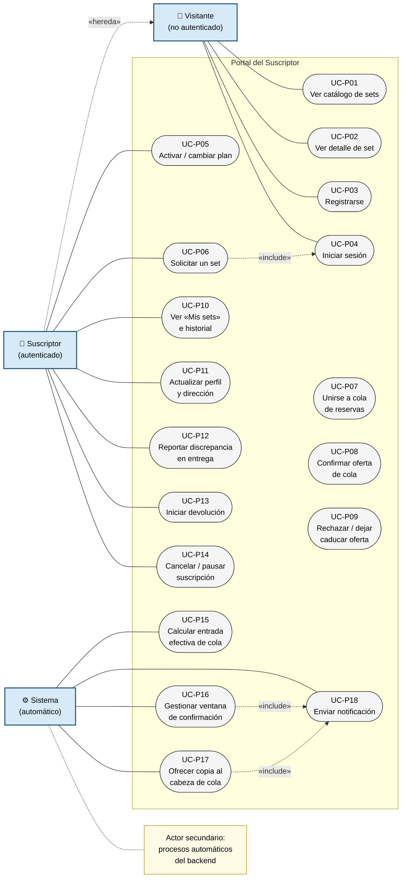
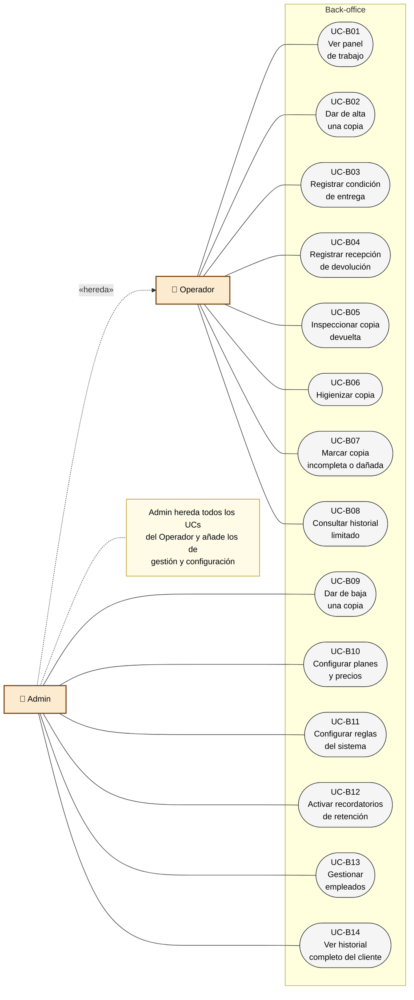
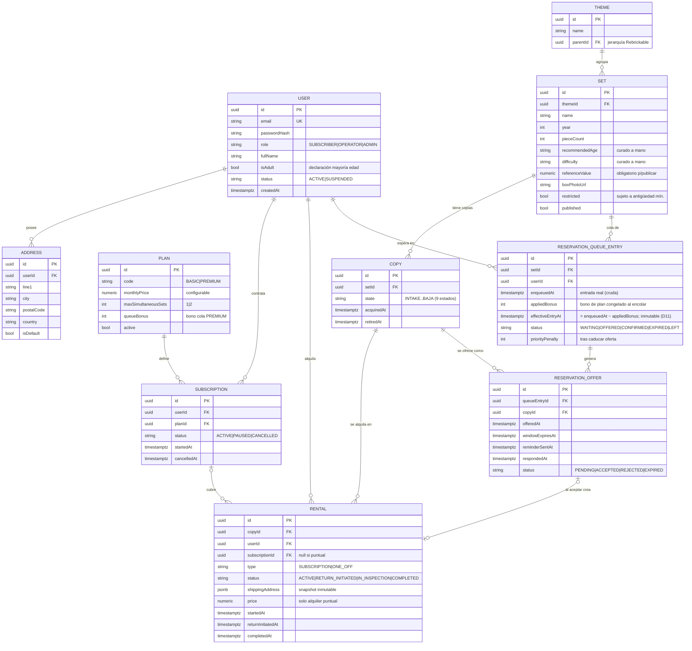
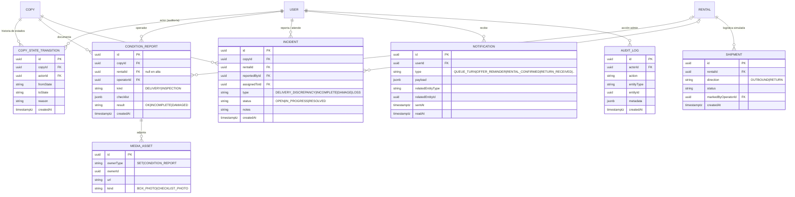
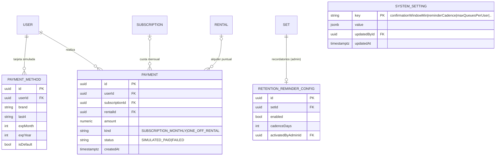
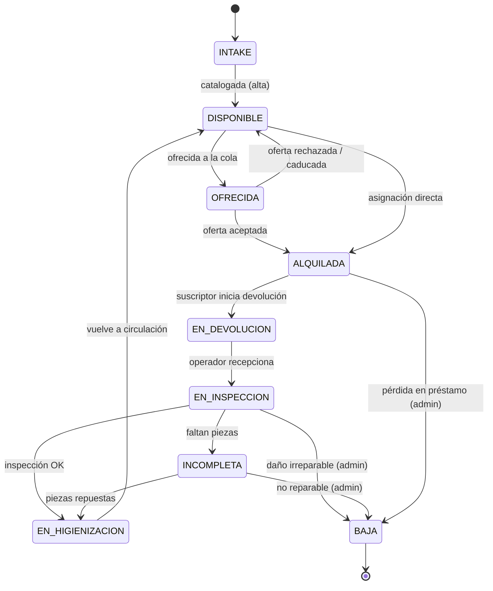

# PRD: Clickoteca — MVP

> **Estado:** borrador para revisión. Sintetizado a partir de
> `openspec/changes/clickoteca-mvp/` (`proposal.md`, `design.md`, `specs/*`,
> `tasks.md`) y de las decisiones registradas en `prompts.md`/`AGENTS.md`. Dos
> secciones quedan explícitamente pendientes en vez de inventadas (§9 Diseño/UX
> y §10 Criterios de éxito) — ver notas en cada una.
>
> Última actualización: 2026-07-03.

## 1. Resumen

**Clickoteca** es una *biblioteca de sets de Lego por suscripción*: el
suscriptor recibe un set, lo disfruta y lo devuelve para pedir otro. Este PRD
cubre el **MVP**: el circuito completo end-to-end (suscripción → selección →
cola de reservas → alquiler → devolución → inspección → higienización → vuelta
a circulación), tanto desde la cara del **suscriptor** como desde el
**back-office** (operadores + admin).

> El nombre "Clickoteca" = *click* (el clic de encajar piezas) + *-oteca*
> (biblioteca/colección). Esquiva por completo la marca registrada LEGO®.

## 2. Problema y propuesta de valor

Los sets de Lego son caros, se montan una vez y luego ocupan espacio: coste +
almacenamiento + "ya me aburrí". Clickoteca resuelve ese dolor con un modelo de
préstamo: se paga una cuota mensual para disfrutar sets sin comprarlos ni
quedárselos.

## 3. Usuarios y roles

El sistema soporta tres roles; cada cuenta tiene exactamente uno. Además, un
**visitante** (usuario sin autenticar) puede explorar una proyección pública del
catálogo, consultar los planes de membresía y sus condiciones, y darse de alta; **no
es un rol de cuenta**, sino el estado sin sesión (sin registro en el modelo de datos)
— ver §4.1, §14.1 y `design.md` D13.

| Acción | Suscriptor | Operador | Admin |
|---|---|---|---|
| Gestionar su cuenta, ver catálogo, solicitar sets, entrar en colas, confirmar ofertas, iniciar devoluciones | ✅ | – | – |
| Acceso al back-office | ❌ | ✅ | ✅ |
| Alta de copias y avance por su ciclo de vida (recepción, inspección, higienización), marcar incidencias | – | ✅ | ✅ |
| Historial de cliente | – | Lectura limitada (soporte) | Completo |
| Dar de **BAJA** una copia | ❌ | ❌ (solo detecta/marca incompleta o dañada) | ✅ |
| Configurar planes/reglas/parámetros, gestionar empleados | ❌ | ❌ | ✅ |

Cada transición de estado y cada acción administrativa registra **quién** la
realizó y **cuándo** (auditoría).

## 4. Alcance funcional del MVP

### 4.1 Cuentas y roles
- Autenticación con los 3 roles anteriores.
- **Acceso público (visitante).** Sin autenticar se puede explorar la proyección
  pública del catálogo (atributos de Set de los Sets publicados, **sin**
  disponibilidad ni posición en cola), ver los planes de membresía con sus
  condiciones e iniciar el alta. El visitante **no es un rol de cuenta**, sino el
  estado sin sesión; la disponibilidad y todo lo de nivel copia/cola exigen login
  (ver `design.md` D13).
- Alta de suscriptor: declaración de mayoría de edad + tarjeta (simulada) +
  dirección de envío/contacto (obligatoria; sin ella no se completa el alta) +
  aceptación de condiciones (texto *lorem ipsum* en el MVP).
- Actualizar la dirección de envío afecta a envíos futuros, no a los ya
  registrados.
- **Alta de personal (solo admin).** El admin crea cuentas de operador o de
  administrador desde el back-office, con una contraseña inicial que **entrega él en
  persona**: no hay invitación por correo. Puede cambiar el rol de un empleado o
  suspenderlo, pero **no reponer la contraseña de nadie** — para eso está el enlace de
  recuperación. Toda alta y todo cambio de rol quedan en auditoría.
- **Volver a contratar desde dentro.** Quien canceló y sigue con sesión abierta
  contrata un plan nuevo desde su portal, conservando cuenta e historial. No se
  "reactiva" la cancelada —ya no rige—: se abre otra sobre la misma cuenta, con la
  dirección y la tarjeta que ya tenía. Sin sesión, el camino equivalente sigue siendo
  el alta acreditando la contraseña.
- **Recuperar el acceso.** Quien olvida su contraseña pide desde el login un enlace
  a la dirección de su cuenta: un solo uso, caducidad de 1 hora, y al gastarse se
  cierran todas las sesiones abiertas. La respuesta a la solicitud es **la misma
  exista o no la cuenta** (no se revela quién está dado de alta). Sin MFA en el MVP.

### 4.2 Catálogo e inventario
- **Set** (modelo de catálogo: foto, nº de piezas, edad recomendada, tema,
  dificultad, **valor de referencia**) vs. **Copia** (unidad física concreta;
  un Set puede tener varias Copias, cada una con su propio estado).
- Un Set no puede publicarse sin valor de referencia.
- Ciclo de vida de la Copia (estados y transiciones válidas únicamente las
  aquí definidas):

  ```
  INTAKE → DISPONIBLE ⇄ OFRECIDA → ALQUILADA → EN_DEVOLUCION → EN_INSPECCION
     pasa OK → EN_HIGIENIZACION → DISPONIBLE
     faltan piezas → INCOMPLETA → (repuesta) → EN_HIGIENIZACION | (no reparable) → BAJA
     daño irreparable → BAJA ;  pérdida en préstamo → BAJA
  ```
- Seed del catálogo: dataset público de Rebrickable (nombre, año, tema, nº
  piezas, foto de caja); edad recomendada y dificultad curadas a mano para el
  subconjunto semilla (no cubiertas por ese dataset).

### 4.3 Suscripciones

| Plan | Sets simultáneos | Precio/mes |
|---|---|---|
| BASIC | 1 | 14,99 € (configurable) |
| PREMIUM | hasta 2 | 24,99 € (configurable) |

Precios anclados a Brick Borrow (UK), el competidor con estructura más
parecida (1 set / 2 sets simultáneos con cambios ilimitados) — detalle del
benchmarking en `design.md` D9.

**Decisión 2026-08-16 (revisión de flujos, `ux-flows.md` §8.1):**

- **Alquilar exige plan.** El **alquiler puntual sin suscripción sale del
  alcance** (§5); la tabla ya no lo recoge y desaparecen sus dos parámetros
  configurables (% sobre el valor de referencia y mínimo).
- **La elección de plan forma parte del alta** (§4.1): no existe el estado
  "cuenta creada sin plan". Usuario, dirección, método de pago y suscripción se
  crean en la misma transacción.
- **Cambio de plan** entre BASIC y PREMIUM, sobre una suscripción existente:
  inmediato al subir; al bajar, **rechazado mientras el suscriptor tenga más
  sets ocupando plaza de los que permite el plan nuevo** (mismo criterio que
  pausar/cancelar). El bono de cola ya aplicado **no se recalcula**: se congela
  al encolar (D11), así que subir de plan no adelanta esperas en curso.

Reglas adicionales:
- No se puede solicitar un nuevo set hasta que la devolución del anterior esté
  **completada** (copia en `DISPONIBLE`); mientras tanto, esa copia sigue
  contando contra el límite del plan.
- Antigüedad mínima configurable (p. ej. 3 meses) para sets marcados como
  restringidos por precio/categoría. **Se muestran en el catálogo señalados con la
  antigüedad que exigen** —también al visitante: es un atributo del set, no
  disponibilidad— y **nunca se ocultan**; la ficha le dice a quien no llega **desde
  qué fecha** podrá alquilarlo.
- No se puede pausar/cancelar la suscripción con una copia en su poder — ver
  §4.7 (camino feliz de cancelación).
- Límite de colas simultáneas por usuario, configurable (default 1, ampliable
  con antigüedad/cumplimiento).

### 4.4 Alquileres y devoluciones
- Solicitud de un Set: si hay copia `DISPONIBLE` se asigna directamente
  (pasa a `ALQUILADA`); si no, se ofrece entrar en la cola (§4.5).
- **Registro de condición en la entrega**: antes de enviar, un operador
  registra un checklist/foto de referencia (con auditoría); el suscriptor,
  dentro de una ventana breve tras recibir la copia, puede confirmar
  conformidad (tácita si no dice nada) o reportar una discrepancia — si la
  reporta, se abre una incidencia de back-office **sin imputársela**.
- El suscriptor inicia la devolución cuando quiere (copia → `EN_DEVOLUCION`,
  con registro/formulario de recogida; logística simulada en el MVP).
- Un operador registra la recepción (→ `EN_INSPECCION`, auditoría), verifica
  completitud e higieniza como **paso separado** posterior a una inspección
  OK.
- La copia liberada solo se ofrece a la cola **después** de que la inspección
  haya dado OK (nunca durante), para no "desprometer" un set que resulte
  incompleto.

### 4.5 Cola de reservas
- Una cola por Set. Orden por `score = días_esperando + bono_plan` (bono fijo
  configurable para PREMIUM, p. ej. +10; +0 para BASIC); empate → quien se
  encoló antes. El tiempo de espera siempre puede superar la ventaja premium.
- Al liberarse una copia, se ofrece al primer elegible (que no supere el
  límite de su plan ni tenga una devolución pendiente que lo bloquee),
  saltando a quien no lo sea.
- Ventana de confirmación configurable por Set: aceptar (asigna la copia y
  sale de la cola) o rechazar explícito (pasa al instante al siguiente
  elegible); recordatorio a mitad de ventana; si caduca sin respuesta, pierde
  el turno y vuelve al **final** de la cola con prioridad reducida (no
  expulsado).

### 4.6 Notificaciones
Al suscriptor: te toca en la cola (+ ventana para confirmar), recordatorio a
mitad de ventana, confirmación de alquiler, recordatorio amable de retención
(cada X días configurable, si hay cola y el admin lo activó para ese set),
devolución recibida (en inspección), devolución completada (ya puede pedir
otro).
Al back-office: devolución incompleta detectada, copia dada de baja.
Seguridad de la cuenta: se ha pedido restablecer la contraseña, la contraseña ha
cambiado (ninguno lleva el enlace dentro — sirven para detectar un intento ajeno).

### 4.7 Otras funcionalidades del suscriptor
- **Buzón de avisos**: lista de los avisos recibidos, que se marcan como leídos uno
  a uno o **todos de una vez**. "Todos" son todos los del usuario, no solo los que
  quepan en la pantalla.
- **"Mis sets"**: vista con los sets actualmente en préstamo, histórico de
  alquileres pasados y posición en la(s) cola(s) activa(s).
- **Cancelación (camino feliz)**: solo cuando el suscriptor no tiene ninguna
  copia en su poder; el sistema confirma que no hay devoluciones pendientes
  ni saldo pendiente antes de completar la baja.

## 5. Fuera de alcance (Non-goals del MVP)

- Pasarela de pagos real (se simula).
- Logística de mensajería real (el estado "en devolución" existe, pero el
  movimiento físico lo marca manualmente un operador).
- Marketplace P2P entre particulares — solo inventario propio.
- Reposición automatizada de piezas — la copia incompleta se gestiona a mano.
- Verificación de identidad real y redacción legal real (texto *lorem ipsum*;
  el titular debe declarar ser adulto con tarjeta de crédito).
- Penalización económica por pérdida de piezas.
- **Alquiler puntual sin suscripción** (fuera desde el 2026-08-16): alquilar
  exige un plan activo. Ver §4.3 y `ux-flows.md` §8.1.

## 6. Flujo end-to-end del suscriptor

1. **Alta**: se registra, declara mayoría de edad, **elige plan (BASIC o
   PREMIUM)**, aporta tarjeta (simulada), dirección de envío/contacto, acepta
   condiciones. La cuenta nace con suscripción activa.
2. **Solicita un Set** del catálogo → asignación directa si hay copia
   disponible, o entra en cola si no.
3. **En cola** (si aplica): espera su turno; el score combina antigüedad en
   cola y bono de plan.
4. **Le toca**: recibe la oferta con ventana de confirmación → acepta,
   rechaza, o la deja caducar (con recordatorio a mitad de ventana).
5. **Entrega**: un operador registra la condición de la copia antes de
   enviarla; el suscriptor confirma conformidad o reporta discrepancia al
   recibirla.
6. **Disfruta el set**: consultable en "Mis sets"; si hay cola para ese set y
   el admin activó recordatorios, los recibe periódicamente.
7. **Inicia devolución** cuando quiere cambiar de set.
8. **Operador recibe e inspecciona**: completo → higienización → disponible
   (u ofrecida si hay cola); incompleto → incidencia de back-office; daño
   irreparable o pérdida → un admin da la copia de baja.
9. **Nuevo set**: solo puede solicitarlo cuando su devolución anterior está
   completada (copia en `DISPONIBLE`).
10. **Cambio de plan** (opcional): BASIC ⇄ PREMIUM; bajar exige no tener más
    sets fuera de los que permite el plan nuevo.
11. **Cancelación** (opcional, camino feliz): solo sin copias en su poder ni
    pendientes.

## 7. Reglas de negocio clave (resumen transversal)

- Modelo Set (catálogo) vs. Copia (unidad física) en dos niveles — permite
  varias copias del mismo set sin refactor.
- Inspección e higienización son **dos pasos separados** de operador (en ese
  orden; intercambiable sin coste).
- Prioridad de cola **aditiva**, nunca multiplicativa (evita que la ventaja
  premium crezca con el tiempo — sería lo contrario de la equidad buscada).
- Dar de baja una copia es **decisión exclusiva de ADMIN** (impacto
  económico); el operador solo detecta y marca.
- Auditoría "quién/cuándo" en toda transición de estado y acción admin.

## 8. Consideraciones legales y de cumplimiento (MVP simulado)

El MVP usa contenido de relleno (*lorem ipsum*) para todo lo legal y no
implementa verificación de identidad real (non-goal, §5). Aun así, un
lanzamiento real necesitaría, como mínimo:

- Términos y condiciones del servicio de suscripción/préstamo.
- Tabla de valoración de sets/piezas — base documental para reclamaciones por
  pérdida o rotura (por eso se guarda el valor de referencia del Set desde
  ahora, aunque no se cobre penalización en el MVP).
- Autorización de cargo recurrente sobre la tarjeta (simulada en el MVP).
- Plantilla de requerimiento fehaciente para impago o no devolución.
- Cumplimiento RGPD (datos personales y dirección de envío del suscriptor).
- Derecho de desistimiento (normativa UE de consumidores para contratos a
  distancia/suscripción).
- Hoja de reclamaciones y enlace a la plataforma de resolución de litigios en
  línea (ODR) de la UE.

## 9. Diseño y experiencia de usuario

**Tres entregables cerrados** (2026-08-16 / 08-19 / 08-20):

1. **[`ux-flows.md`](ux-flows.md)** — actores y superficies, mapa de navegación y
   flujos de tarea por rol (visitante, suscriptor, operador, admin y el sistema),
   con la tabla de cobertura historia → flujo → pantalla.
2. **[`design-system.md`](design-system.md)** — paleta OKLCH con contrastes
   medidos, tipografía y ritmo, cinco tonos de estado y el vocabulario que traduce
   los estados del dominio a lo que ve cada rol. No es solo documento: vive en
   `app/globals.css` y `lib/status.ts`, y la suite mide el contraste contra el CSS
   real en los dos temas.
3. **[`wireframes.md`](wireframes.md)** — las cinco pantallas que faltaban (ficha
   de set, registro de condición, discrepancia, catálogo de back-office y portal
   ampliado), con su disposición, sus datos, sus errores reales y sus vacíos.

**Las cinco pantallas están construidas** (2026-08-20): la ficha de set
`/catalogo/:id` —donde D13 se hace visible, el mismo recurso con dos proyecciones—,
el registro de condición, la franja de discrepancia, el catálogo del back-office y el
portal ampliado. Los dos huecos bloqueantes que destapó dibujarlas se resolvieron
antes de construirlas: la copia `ALQUILADA` no aparecía en la cola de trabajo del
operador y la lista de comprobación del registro de condición no existía en ninguna
capa (`wireframes.md` §8.1 y §8.2).

Ese cruce entre las historias y el código implementado deja un dato que este PRD
debe recoger: **las 18 de 18 historias tienen ya recorrido completo por interfaz**
(2026-08-21). Las dos últimas fueron **HU-06** —la posición en cola, que no llegaba
al portal (`wireframes.md` §8.4)— y **HU-16**, cuyos endpoints de planes y
recordatorios de retención existían sin pantalla desde la que ejecutarse.

**Desplegado** en **https://clickoteca.vercel.app** (Vercel + Supabase,
`documents/ADR-0003`), y con eso **se retira el videotutorial** (decisión del
2026-09-06): la evaluación se hace sobre la aplicación real —credenciales por el
canal del curso— y no sobre una grabación de ella, que solo mostraría el recorrido
que el autor eligiera mostrar. No queda ningún entregable abierto.

## 10. Criterios de éxito del MVP

Este MVP es un proyecto académico (AI4Devs/Lidr) que **no escalará a
producción**, así que no aplican KPIs de negocio (conversión, churn, MRR...).
Se define el éxito como:

- Circuito E2E completo y **demostrable**, desde ambas caras (suscriptor y
  back-office): suscripción → cola → alquiler → devolución → inspección →
  higienización → de vuelta a disponible.
- `openspec validate clickoteca-mvp --strict` en verde (`tasks.md` 8.5).
- Cobertura de tests priorizando caminos de error y casos límite, no solo el
  camino feliz (criterio no negociable fijado en `tasks.md`).

## 11. Riesgos y trade-offs

- **Integridad de piezas**: verificar la completitud de un set de
  cientos/miles de piezas es el reto operativo central. Mitigación del MVP:
  inspección manual como estado de primera clase, sin reposición automática.
- **Logística simulada**: el coste real de envío bidireccional puede superar
  la cuota; queda fuera del MVP pero condicionará el modelo de negocio real.
- **Equidad vs. conversión premium**: el bono de cola es la palanca de
  tensión entre ambas; se deja configurable para poder ajustarlo con datos
  reales.

## 12. Preguntas abiertas y backlog (próxima iteración)

**Abiertas:**
- Categorías/umbral exacto de "set premium" sujeto a antigüedad mínima — a
  definir con datos reales del catálogo.
- Valores por defecto de la ventana de confirmación y de la cadencia de
  recordatorios.

**Backlog (fuera de este MVP):**
- Búsqueda/filtro de catálogo (tema, edad, dificultad, disponibilidad).
- Panel de métricas para admin (utilización, tiempo medio en cola, sets más
  solicitados).
- Valoración/reseña del set por el suscriptor tras la devolución.

## 13. Referencias

- `openspec/changes/clickoteca-mvp/proposal.md`
- `openspec/changes/clickoteca-mvp/design.md` (decisiones D1–D9)
- `openspec/changes/clickoteca-mvp/specs/{accounts-roles, catalog-inventory, subscriptions, rentals-returns, reservation-queue, notifications}/spec.md`
- `openspec/changes/clickoteca-mvp/tasks.md`
- `prompts.md` (log de decisiones, 2026-07-02 y 2026-07-03)

---

## 14. Casos de uso

Se modelan los casos de uso más importantes del MVP en dos diagramas Mermaid,
uno por superficie de la aplicación. Los diagramas siguen la notación UML
estándar:

- **Herencia de actores** (`--|>`): el actor especializado hereda todos los UCs
  del actor general y añade los suyos propios.
- **`<<include>>`**: el UC base siempre ejecuta el UC incluido como parte de su
  flujo (obligatorio).
- **`<<extend>>`**: el UC extensión añade comportamiento opcional al UC base
  bajo la condición indicada.
- **Actor "Sistema"** (diagrama portal): actor secundario que representa los
  procesos automáticos del backend (entrada efectiva de cola, ventanas de
  confirmación, notificaciones).

---

### 14.1 Portal del Suscriptor

#### Actores

| Actor | Descripción |
|---|---|
| **Visitante** | Usuario no autenticado. Puede explorar la proyección pública del catálogo (sin disponibilidad ni cola), ver planes/condiciones y registrarse. **No es un rol de cuenta** (ver `design.md` D13). |
| **Suscriptor** | Usuario autenticado (hereda los UCs del Visitante). Gestiona su suscripción, solicita sets, interactúa con la cola y gestiona devoluciones. |
| **Sistema** | Actor secundario automático: calcula la entrada efectiva de cola al encolar, gestiona ventanas de confirmación, dispara notificaciones y ofertas. |

#### Tabla de casos de uso — Portal

| ID | Nombre | Actor principal | Descripción breve |
|---|---|---|---|
| UC-P01 | Ver catálogo de sets | Visitante | Navega la lista de sets disponibles en el catálogo. |
| UC-P02 | Ver detalle de set | Visitante | Consulta la ficha del set (foto, nº de piezas, tema, dificultad, y si exige antigüedad mínima). La **disponibilidad y la posición en cola** solo son visibles para suscriptores autenticados (proyección pública vs. autenticada, `design.md` D13). |
| UC-P03 | Registrarse | Visitante | Alta como suscriptor: datos personales, declaración de mayoría de edad, tarjeta simulada, dirección de envío (obligatoria) y aceptación de condiciones. |
| UC-P04 | Iniciar sesión | Visitante | Autenticación con credenciales. Precondición implícita de todos los UCs del Suscriptor. |
| UC-P05 | Cambiar de plan | Suscriptor | Cambia entre BASIC (14,99 €/mes, 1 set) y PREMIUM (24,99 €/mes, hasta 2 sets simultáneos). La contratación inicial ocurre en el alta (UC-P03); bajar de plan se rechaza si tiene más sets fuera de los que permite el plan nuevo. |
| UC-P06 | Solicitar un set | Suscriptor | Solicita el alquiler de un set. Si hay copia `DISPONIBLE`, se asigna directamente. Si no, se ofrece unirse a la cola (UC-P07). |
| UC-P07 | Unirse a la cola de reservas | Suscriptor | Se añade a la cola del set cuando no hay copias disponibles. Sujeto al límite de colas simultáneas por usuario (configurable, default 1). |
| UC-P08 | Confirmar oferta de cola | Suscriptor | Acepta la asignación de la copia dentro de la ventana de confirmación. La copia pasa a `ALQUILADA` y el suscriptor abandona la cola. |
| UC-P09 | Rechazar / dejar caducar oferta | Suscriptor | Rechaza explícitamente o deja expirar la oferta sin responder. La oferta pasa al siguiente elegible; el suscriptor vuelve al final de la cola con prioridad reducida. |
| UC-P10 | Ver «Mis sets» e historial | Suscriptor | Consulta los sets actualmente en préstamo, el historial de alquileres pasados y la posición en sus colas activas. |
| UC-P11 | Actualizar perfil y dirección de envío | Suscriptor | Modifica datos de contacto y dirección de envío. Los cambios afectan solo a envíos futuros. |
| UC-P12 | Reportar discrepancia en la entrega | Suscriptor | Notifica, dentro de la ventana de entrega, que la copia recibida no coincide con el registro de condición. Se abre una incidencia de back-office sin imputársela al suscriptor. |
| UC-P13 | Iniciar devolución | Suscriptor | Solicita la recogida del set. La copia transita a `EN_DEVOLUCION` y se genera el registro de recogida (logística simulada). |
| UC-P14 | Cancelar / pausar suscripción | Suscriptor | Solo posible en el camino feliz: sin copias en su poder ni saldo pendiente. |
| UC-P15 | Calcular entrada efectiva de cola | Sistema | Al encolar, congela el bono de plan y calcula `effectiveEntryAt = enqueuedAt − bono` (PREMIUM +N configurable, BASIC +0), marca **inmutable** que fija la posición. El orden es `effectiveEntryAt` ascendente, desempate por antigüedad; sin recálculo periódico (`design.md` D11). |
| UC-P16 | Gestionar ventana de confirmación | Sistema | Envía recordatorio a mitad de ventana; si caduca sin respuesta, re-encola al suscriptor con prioridad reducida y pasa la oferta al siguiente elegible. Incluye UC-P18. |
| UC-P17 | Ofrecer copia al cabeza de cola | Sistema | Tras inspección OK, notifica al primer suscriptor elegible de la cola (el que no supera su límite de plan ni tiene devolución pendiente). Incluye UC-P18. |
| UC-P18 | Enviar notificación | Sistema | Entrega la notificación al suscriptor correspondiente al evento de dominio (turno en cola, confirmación, recordatorio, devolución completada, etc.). |

#### Diagrama Mermaid — Portal del Suscriptor



---

### 14.2 Back-office (Operador / Admin)

#### Actores

| Actor | Descripción |
|---|---|
| **Operador** | Empleado operativo. Gestiona el ciclo de vida de las copias, registra condiciones y recepciones, inspecciona e higieniza, y da soporte consultando el historial limitado del cliente. |
| **Admin** | Hereda todos los UCs del Operador y añade capacidades exclusivas: dar de baja copias, configurar planes/reglas del sistema y gestionar empleados. |

#### Tabla de casos de uso — Back-office

| ID | Nombre | Actor | Descripción breve |
|---|---|---|---|
| UC-B01 | Ver panel de trabajo | Operador | Vista de copias agrupadas por estado operativo (pendientes de inspección, higienización, etc.). Punto de entrada del flujo diario. |
| UC-B02 | Dar de alta una copia | Operador | Registra una nueva unidad física de un Set y la lleva de `INTAKE` a `DISPONIBLE` completando su catalogación. |
| UC-B03 | Registrar condición de entrega | Operador | Documenta el estado de la copia (checklist / foto) antes del envío al suscriptor. Queda registrado con auditoría (operador + timestamp). |
| UC-B04 | Registrar recepción de devolución | Operador | Marca la copia devuelta como recibida (`EN_DEVOLUCION` → `EN_INSPECCION`). Auditoría del operador que la recepciona. |
| UC-B05 | Inspeccionar copia devuelta | Operador | Verifica completitud e integridad: resultado OK → `EN_HIGIENIZACION`; incompleta → UC-B07; irreparable/perdida → solicita baja al Admin. |
| UC-B06 | Higienizar copia | Operador | Completa la limpieza de la copia: `EN_HIGIENIZACION` → `DISPONIBLE` (o `OFRECIDA` si hay cola activa para ese Set). |
| UC-B07 | Marcar copia incompleta o dañada | Operador | Detecta y registra la incidencia tras inspección. La copia queda en `INCOMPLETA` pendiente de reposición o baja por Admin. |
| UC-B08 | Consultar historial limitado del cliente | Operador | Vista de lectura parcial del historial del suscriptor para atención y soporte telefónico/email (sin datos sensibles completos). |
| UC-B09 | Dar de baja una copia | **Admin** | Transita la copia a `BAJA` (daño irreparable, pérdida o sustracción). Acción exclusiva del Admin por su impacto económico. |
| UC-B10 | Configurar planes y precios | **Admin** | Ajusta el precio mensual, los sets simultáneos y el bono de cola de BASIC y PREMIUM. |
| UC-B11 | Configurar reglas del sistema | **Admin** | Establece: duración de la ventana de confirmación —que es además el plazo para reclamar una entrega—, penalización por dejar caducar una oferta, antigüedad mínima para sets restringidos, límite de colas simultáneas por usuario y cadencia por defecto de los recordatorios. El **bono de cola no está aquí**: vive en el plan (UC-B10), que es de donde lo lee el encolado. |
| UC-B12 | Activar recordatorios de retención | **Admin** | Habilita recordatorios periódicos para un Set concreto que acumula cola, enviados al suscriptor que lo retiene. |
| UC-B13 | Gestionar empleados | **Admin** | Crea, modifica y desactiva cuentas de Operadores. |
| UC-B14 | Ver historial completo del cliente | **Admin** | Acceso completo al historial de alquileres, estado de suscripción y perfil del suscriptor. |

#### Diagrama Mermaid — Back-office



---

## 15. Modelo de datos

Modelo de datos del MVP para **PostgreSQL + Prisma** (ver stack en `AGENTS.md`). Los
nombres de modelo van en inglés (convención Prisma) con el término del PRD entre
paréntesis. El esquema ejecutable vive en `prisma/schema.prisma`.

Las entidades se organizan en **tres anillos por orden de importancia**:

- **Anillo 1 — Núcleo del circuito E2E:** `User`, `Session`, `PasswordResetToken`,
  `Set`, `Copy`, `Subscription`, `Rental`, `ReservationQueueEntry`,
  `ReservationOffer`.
- **Anillo 2 — Operación y trazabilidad:** `ConditionReport`, `Incident`,
  `CopyStateTransition`, `AuditLog`, `Notification`, `Shipment`.
- **Anillo 3 — Configuración y pagos (simulados):** `Plan`, `SystemSetting`,
  `RetentionReminderConfig`, `PaymentMethod`, `Payment`, `Address`, `Theme`,
  `MediaAsset`.

### 15.1 Decisiones de modelado

- **`Set` (catálogo) vs. `Copy` (unidad física)** en dos niveles: todo el ciclo de
  vida y los alquileres cuelgan de `Copy`, no de `Set` (§7).
- **Un único `User` con `role`** (`SUBSCRIBER | OPERATOR | ADMIN`): no se modela una
  entidad `Employee` aparte en el MVP; solo se separaría si hicieran falta datos
  laborales (turnos, etc.).
- **`Session` para la sesión server-side** (`ADR-0002` §1): la cookie `httpOnly`
  transporta un token opaco y la tabla guarda solo su **hash**, de modo que un
  volcado de la base no permite suplantar sesiones. Revocar es borrar la fila.
- **`PasswordResetToken` para recuperar el acceso**: misma figura que `Session` y por
  la misma razón — el enlace que viaja en el correo es un token aleatorio del que la
  tabla guarda solo el **hash**. Caduca en 1 hora y se marca `usedAt` al gastarse en
  vez de borrarse, para poder responder "este enlace ya se usó" a quien reabre el
  correo, y para dejar rastro de un incidente. Gastar uno cierra todas las `Session`
  del usuario.
- **`Set.setNum` (referencia de Rebrickable, único y opcional)**: conserva la
  procedencia de cada ficha del catálogo semilla y hace idempotente la carga de
  datos; `null` en los sets dados de alta a mano desde el back-office.
- **Orden de cola por `effectiveEntryAt` inmutable** (`design.md` D11): al encolar se
  congela el bono de plan (`appliedBonus`) y se calcula, una sola vez,
  `effectiveEntryAt = enqueuedAt − appliedBonus`. El orden es `effectiveEntryAt ASC`
  (desempate por `id`), **sin recálculo periódico**: por ser la prioridad aditiva, la
  ordenación es invariante en el tiempo. Se descarta el `score` materializado + su
  recálculo (enfoque anterior); UC-P15 se reinterpreta como el cálculo de
  `effectiveEntryAt` al encolar.
- **`Rental.shippingAddress` como snapshot JSON** (no FK a `Address`): cambiar la
  dirección afecta a envíos futuros, no a los ya registrados (§4.1).
- **`Subscription` opcional en `Rental`** (`type = ONE_OFF`): cubría el alquiler
  puntual sin suscripción. **Desde el 2026-08-16 esa vía está fuera de alcance**
  (§4.3/§5), así que el `RentalType` del MVP es siempre `SUBSCRIPTION`. Las columnas
  se mantienen —quitarlas cuesta una migración y no estorban— pero **no deben
  poblarse**: un alquiler sin suscripción ya no es un estado alcanzable. Lo mismo
  vale para `Rental.price` y la relación con `Payment` en los diagramas de abajo.
- **`ReservationOffer` separada de `ReservationQueueEntry`**: una entrada en cola
  puede recibir varias ofertas (aceptar/rechazar/caducar y re-encolar); modelarlas
  aparte hace triviales la ventana de confirmación y la auditoría.
- **`CopyStateTransition` (ciclo de vida) y `AuditLog` (genérico)** separados: la
  máquina de estados de la copia es de primera clase (§7); `AuditLog` cubre el resto
  de acciones admin (config, gestión de empleados).
- **`SystemSetting`** clave-valor para los parámetros configurables: ventana de
  confirmación, penalización por caducidad, cadencia de recordatorios, límite de colas
  por usuario y antigüedad mínima de sets restringidos. El **bono de cola** llegó a
  estar en esta lista (`premiumQueueBonusDays`) y **se retiró el 2026-08-21**: nadie lo
  leía —el encolado congela `Plan.queueBonus`— y en la pantalla de configuración
  aparentaba ser un mando más.

### 15.2 Diagrama — Núcleo del circuito (Anillo 1)



### 15.3 Diagrama — Operación y trazabilidad (Anillo 2)



### 15.4 Diagrama — Configuración y pagos (Anillo 3)



### 15.5 Ciclo de vida de `Copy`


