# Flujos por rol — Clickoteca

> **Qué es esto.** El primer entregable de diseño/UX del proyecto (`PRD.md` §9, que
> hasta ahora estaba deliberadamente vacío). No propone estética ni maquetación:
> establece **quién hace qué, desde dónde y en qué orden**, que es lo que condiciona
> después las pantallas.
>
> **De dónde sale.** De cruzar tres fuentes: las historias de
> [`user_stories.md`](user_stories.md) (qué debería poder hacerse), las specs de
> `openspec/changes/clickoteca-mvp/specs/*` y `PRD.md` §14 (bajo qué reglas), y el
> **código realmente implementado** en `app/` (qué se puede hacer hoy). Ese tercer
> cruce es el que aporta la información nueva: hay historias completas en la API que
> **no tienen ninguna pantalla desde la que ejecutarse**.
>
> **Estado:** 2026-08-16, revisado el 2026-08-19. La primera decisión de alcance
> —plan en el alta, HU-02 como cambio de plan, alquiler puntual fuera— está tomada,
> registrada en **§8.1** e **implementada**. Del §8.2 se ha cerrado el punto 5
> (lenguaje visual de los estados) con [`design-system.md`](design-system.md), que es
> el segundo entregable de UX; el siguiente son los wireframes (**§9**).

---

## 1. Actores y superficies

`PRD.md` §3 y `design.md` D13 fijan **tres roles de cuenta** y un **actor no
autenticado**. La frontera no es un rol más: es una proyección de datos distinta.

| Actor | Rol de cuenta | Superficie | Ruta base | Cómo se le deja entrar |
|---|---|---|---|---|
| **Visitante** | — (sin sesión) | Pública | `/`, `/catalogo`, `/planes`, `/registro`, `/login`, `/recuperar-contrasena`, `/restablecer-contrasena` | Abierta |
| **Suscriptor** | `SUBSCRIBER` | Portal | `/portal` | `proxy.ts` → `portal.access` |
| **Operador** | `OPERATOR` | Back-office | `/backoffice` | `proxy.ts` → `backoffice.access` |
| **Admin** | `ADMIN` | Back-office (ampliado) | `/backoffice` + `configuracion`, `empleados` | Permisos `settings.manage`, `employee.manage`, `copy.retire` |
| **Sistema** | — | Sin interfaz | `scheduler/` | Procesos automáticos; su salida **sí** se ve como avisos |

Dos reglas de navegación que ya están implementadas y que el diseño debe respetar,
no reinventar:

1. **Cada rol tiene una única superficie de destino.** Un suscriptor que intenta
   `/backoffice` no ve un 403: se le **redirige** a `/portal`, y al revés
   ([`decideSurfaceAccess`](../src/domain/auth/access.ts)). El error 403 sin salida
   se considera un fallo de UX, no una medida de seguridad.
2. **Admin ⊇ Operador.** El admin no tiene un panel aparte: ve el mismo back-office
   con más entradas de menú ([`permissions.ts`](../src/domain/auth/permissions.ts)).
   El diseño debe reflejar *ampliación*, no *duplicación*.

---

## 2. Mapa de navegación

Colores: **verde** = la pantalla existe y cubre su cometido · **ámbar** = existe pero
incompleta · **rojo** = no existe. Las rutas en rojo cuya funcionalidad sí está en la
API se detallan en §7.

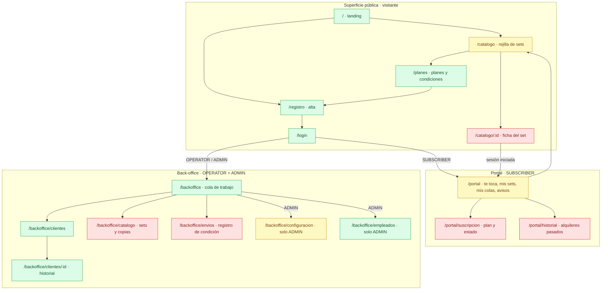

> **Añadido el 2026-09-06** (cambio `recuperar-contrasena`, posterior a esta
> auditoría): la superficie pública gana `/recuperar-contrasena` y
> `/restablecer-contrasena`, colgando de `/login`. No alteran el mapa —son una salida
> lateral del acceso, no un destino nuevo del recorrido—, pero cierran el único
> callejón sin retorno que le quedaba al login.

**El hueco estructural del mapa es `/catalogo/:id`.** Hoy el catálogo es una rejilla
sin destino: no existe ficha de set. Y la ficha es justamente donde viven las dos
acciones centrales del suscriptor — *solicitar* y *encolarse* —, además de ser el
único punto donde la proyección pública y la autenticada se distinguen de verdad
(D13: el visitante ve el set, pero no su disponibilidad). Sin esa pantalla, el
producto no tiene camino de compra.

---

## 3. Flujos del visitante

### V1 · Descubrir y decidir

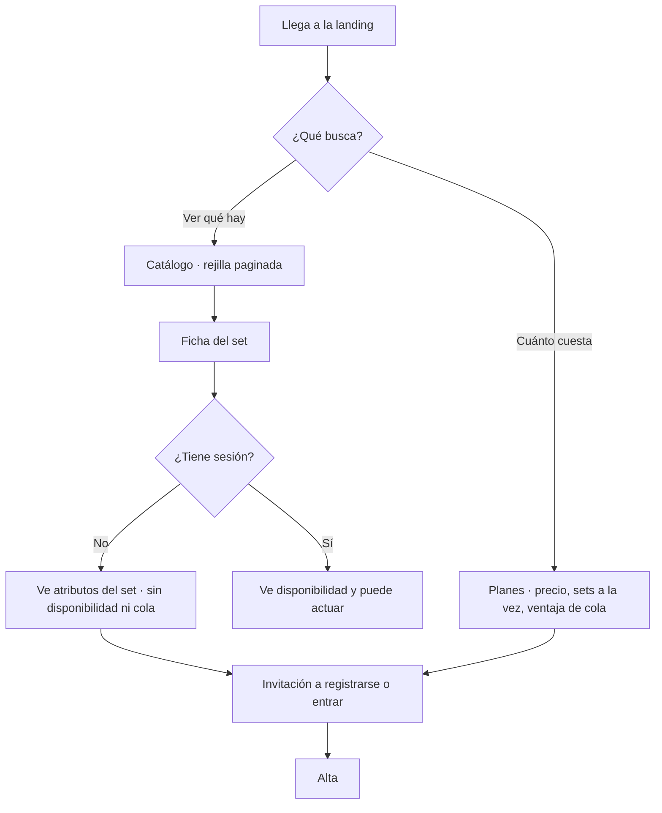

**Estado.** Landing, catálogo y planes existen y ya llevan la invitación contextual
al visitante ([catalogo/page.tsx:45](../app/(public)/catalogo/page.tsx#L45)). Falta
la ficha, y con ella el paso `E → F`, que es donde D13 se hace visible.

**Decisiones de UX pendientes**

- La rejilla no tiene **filtros ni búsqueda** (35 sets sembrados, paginación de 24).
  ¿Filtrar por tema, piezas, dificultad y edad, o dejarlo para después?
- En la ficha, ¿cómo se le dice al visitante que *hay* información que no ve sin
  ocultarle que existe? (Un hueco silencioso confunde; un candado invita a entrar.)

### V2 · Alta, con plan

> **Decisión del 2026-08-16.** La elección de plan **forma parte del alta** (HU-01),
> y el **alquiler puntual sale del alcance**: para alquilar hay que tener plan. Esto
> cierra el callejón que tenía el flujo —una cuenta creada sin ninguna forma de
> contratar— y elimina de la pantalla la tercera vía "entrar sin suscripción".

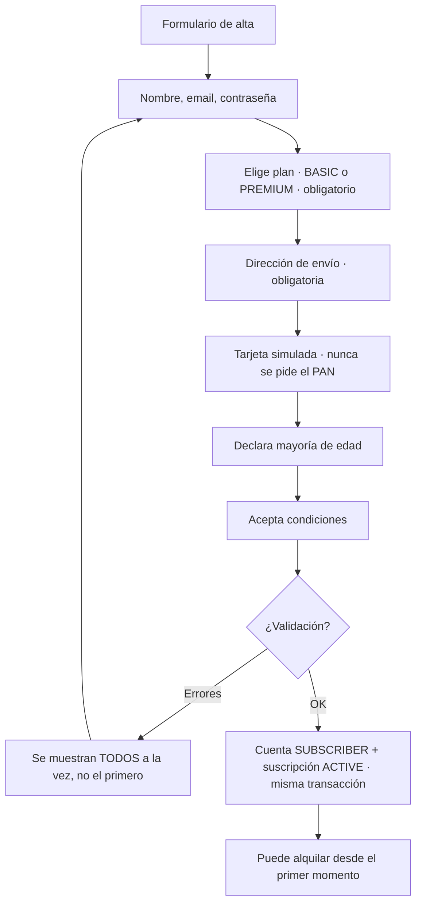

**Estado.** El formulario existe y es completo salvo el plan, que hay que añadir.
El caso de uso **acumula los errores en `errors[]`** en vez de cortar en el primero
— es una decisión de UX ya tomada en el backend que la pantalla debe honrar
mostrándolos todos juntos, y el plan que falta es un error más de esa lista.

**Consecuencia de implementación:** `register-subscriber.ts` ya crea usuario,
dirección y método de pago **en una transacción**; la suscripción entra en esa misma
transacción. No hay estado intermedio "cuenta sin plan" que pueda quedarse a medias.

**Decisión de UX pendiente.** ¿El plan se elige *dentro* del formulario de alta o en
un paso previo desde `/planes`? Las dos entradas existen ya en la interfaz — la
landing lleva a `/registro` y las tarjetas de `/planes` llevan a `Empezar con
{plan}` —, así que el formulario debe **admitir el plan preseleccionado por la URL**
y seguir permitiendo cambiarlo sin volver atrás.

---

## 4. Flujos del suscriptor

### S1 · Conseguir un set — el flujo central del producto

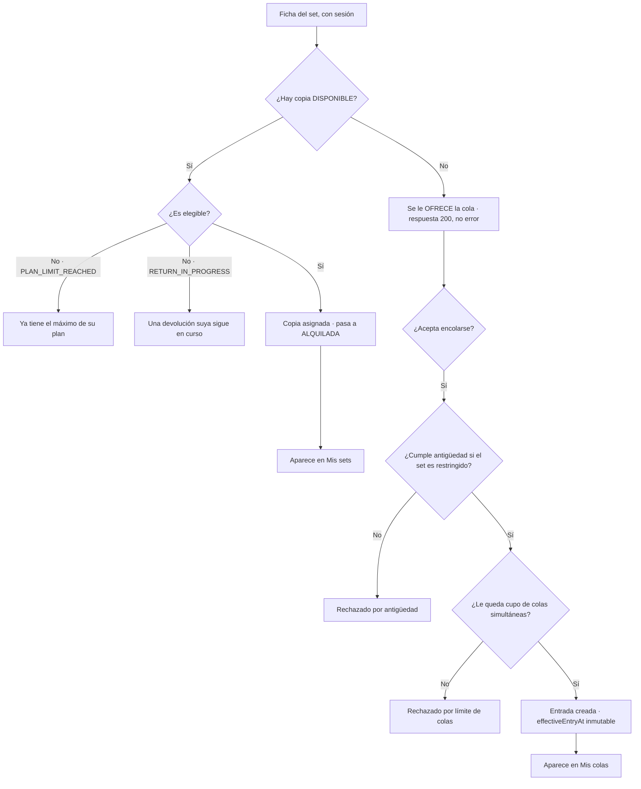

Este diagrama es, línea por línea, la parte del sistema con **más reglas de negocio
por píxel**, y ninguna tiene hoy dónde manifestarse. Tres matices que el diseño
tiene que saber:

- **Sin copias no es un error.** La API responde `200` con `canQueue`, porque la
  spec dice que se *ofrece* la cola. La pantalla debe leerse como una oferta, no
  como un fallo.
- **Los dos motivos de no elegibilidad se distinguen a propósito**, porque la acción
  que los resuelve es distinta: uno se arregla devolviendo, el otro esperando a que
  termine una inspección. El mensaje no puede ser genérico.
- **Al encolar se comprueba la antigüedad pero NO el tope de plan**: encolarse para
  más adelante es legítimo aunque ahora tengas el máximo fuera. El diseño no debe
  "ayudar" deshabilitando el botón de cola cuando el usuario está al límite.

**Estado:** `POST /api/sets/:id/rentals`, `POST /api/sets/:id/queue` y `GET
/api/sets/:id/eligibility` funcionan y están testeados. **Ninguno tiene interfaz.**

### S2 · Responder a una oferta de cola

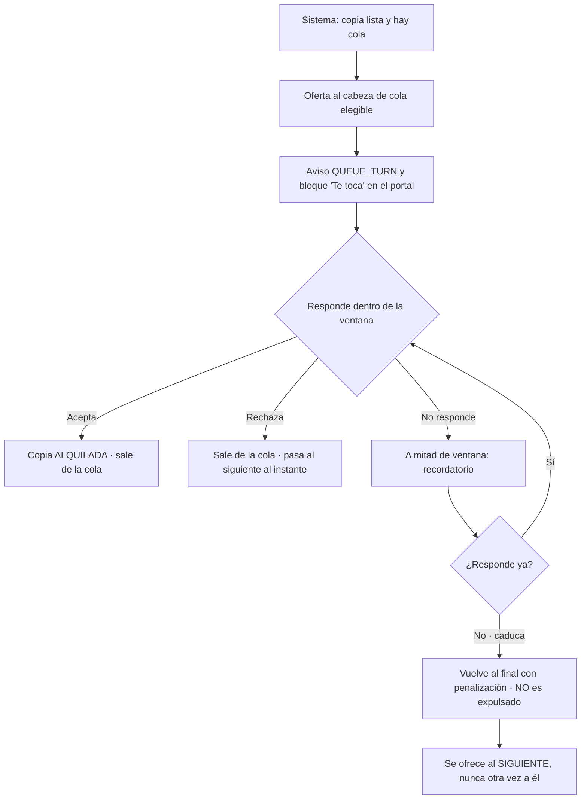

**Estado: completo, y es el único flujo del suscriptor con interfaz real**
([portal-actions.tsx](../app/(portal)/portal/portal-actions.tsx)).

**Decisión de UX pendiente — la más urgente de este flujo.** El bloque "Te toca"
muestra la fecha límite (`Tienes hasta el 16 ago 2026, 18:30`), pero **una ventana
de confirmación se vive como cuenta atrás, no como fecha**. Y la diferencia entre
*rechazar* (renuncias) y *dejar caducar* (pierdes prioridad) es una regla fina que
ahora mismo no se explica en ninguna parte: los dos botones parecen simétricos y no
lo son.

### S3 · Devolver

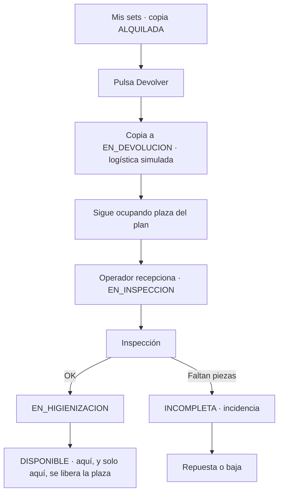

**Estado: implementado con interfaz.** El punto que el diseño debe comunicar es el
más contraintuitivo del producto: **la plaza no se libera al devolver, sino cuando
la copia vuelve a estar `DISPONIBLE`**. El portal hoy dice `devolución en curso` y
nada más; el usuario no sabe en qué punto del proceso está su devolución ni por qué
todavía no puede pedir otro set.

### S4 · Reportar discrepancia en la entrega

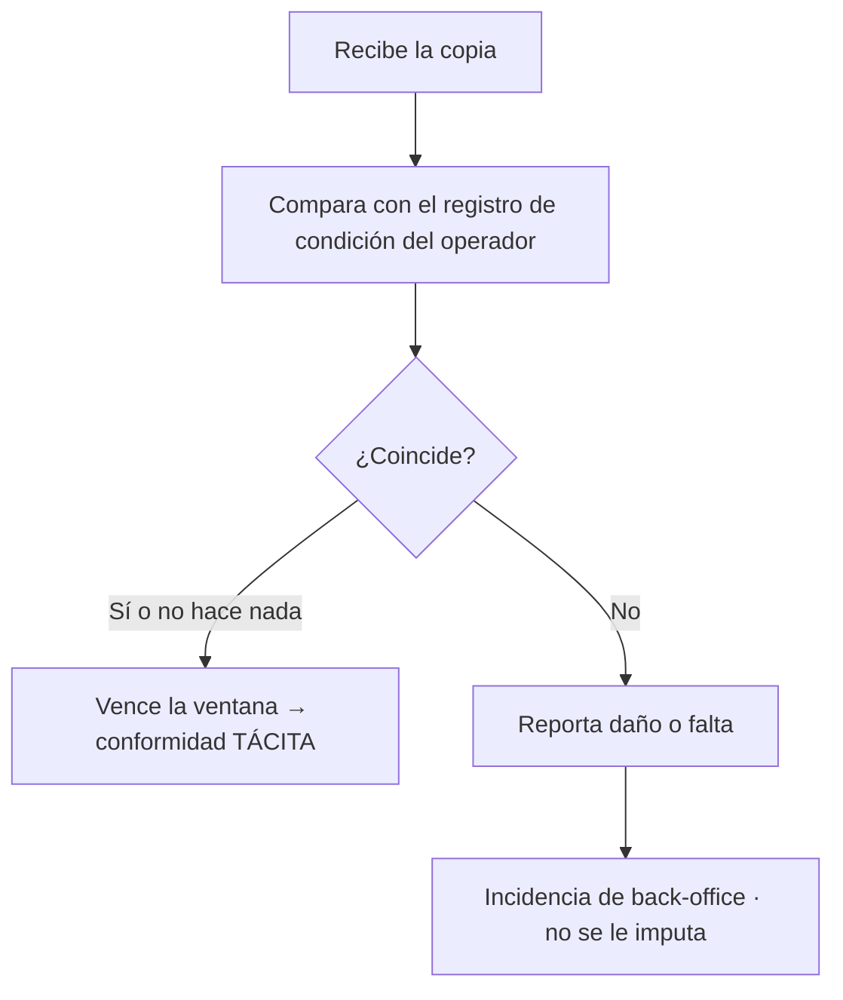

**Estado: solo API** (`GET /api/rentals/:id/delivery` para ver la situación de la
confirmación, `POST /api/rentals/:id/discrepancy` para reclamar). Sin
pantalla, la ventana de reclamación **siempre caduca en silencio** y la conformidad
tácita se convierte en la única salida posible — lo contrario de lo que pretende
HU-07. Es el hueco con más consecuencias para el usuario, porque le hace cargar con
un daño que no causó.

Nota de diseño: la conformidad tácita **no se persiste** (es la ausencia de
discrepancia pasada la ventana). Así que en pantalla no hay un estado "conforme" que
leer de la base: hay que **calcularlo y mostrarlo como cuenta atrás mientras la
ventana está abierta**, o el usuario no se enterará de que existe.

### S5 · Gestionar la suscripción — cambiar de plan, pausar, cancelar

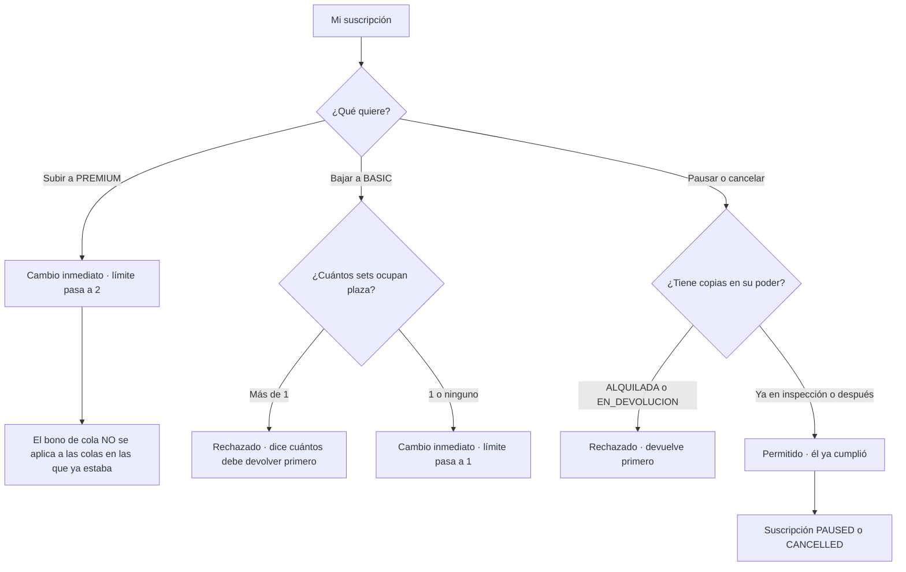

**Estado: solo API, y parcial.** `PUT /api/subscriptions/me` cubre pausar, cancelar
y reactivar, pero **no el cambio de plan**: solo acepta
`status: ACTIVE|PAUSED|CANCELLED`, nunca un plan. HU-02 necesita ampliarlo (o un
endpoint hermano) además de la pantalla.

Tres reglas que el diseño debe hacer visibles:

- **El downgrade bloqueado se explica en número, no en abstracto.** "Devuelve 1 set
  para poder pasar a Basic" es accionable; "tienes pendientes" no lo es. Es el mismo
  criterio que ya se aplica al cancelar.
- **Subir de plan no reordena las colas.** `appliedBonus` se congela al encolar
  (D11), así que hacerse premium **no adelanta** las esperas ya en curso. Es
  exactamente lo que un usuario espera que ocurra, así que hay que decirlo *antes*
  de que pague, no después.
- **Pausar es más permisivo que pedir otro set.** Si la copia ya está en inspección,
  el suscriptor cumplió y retenerle la suscripción por un proceso interno nuestro
  sería injusto — el conjunto que bloquea es más estrecho. El mensaje de rechazo
  debe decir exactamente qué falta.

### S6 · Ver lo mío

**Estado: parcial.** `/portal` cubre sets activos, colas, ofertas y avisos. Faltan
tres cosas que HU-06 pide explícitamente:

| Falta | Dónde está el dato |
|---|---|
| **Historial** de alquileres pasados | `GET /api/rentals` |
| **Posición** en cada cola | Hoy solo se muestra la fecha de entrada y la ventaja en días |
| **Marcar un aviso como leído** | `POST /api/notifications/:id/read`, sin UI |

Y un detalle que se ve al primer vistazo: los avisos se pintan con su **enum crudo**
(`QUEUE_TURN`, `RETENTION_REMINDER`) en vez de con un texto legible
([portal/page.tsx:120](../app/(portal)/portal/page.tsx#L120)).

---

## 5. Flujos del back-office

### O1 · La cola de trabajo — el bucle del operador

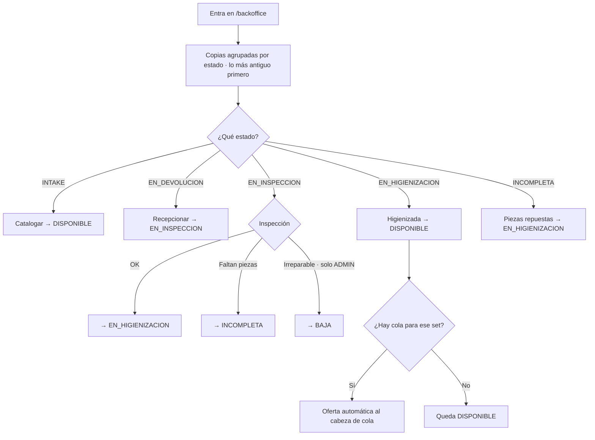

**Estado: implementado**, y es la pantalla mejor resuelta del sistema — está
ordenada por espera, no por llegada, que es el criterio correcto para "qué hago
ahora".

**Decisión de diseño ya tomada que conviene no deshacer:** al operador **se le
muestra el botón "Dar de baja" aunque no tenga permiso**, y recibe un 403 al
pulsarlo. Es deliberado ([work-queue-actions.tsx:40](../app/(backoffice)/backoffice/work-queue-actions.tsx#L40)):
esconder acciones deja a la gente sin saber por qué no están. El diseño puede
mejorarlo (marcarlo como "requiere admin" *antes* de pulsar) pero no debe ocultarlo.

**Hueco:** las copias `ALQUILADA` **pendientes de envío no aparecen en la cola de
trabajo** ([`ORDER`](../app/(backoffice)/backoffice/page.tsx#L22) no las incluye). Es
decir: el operador no tiene forma de saber que hay un set esperando a ser preparado
y enviado. Ver O2.

### O2 · Preparar el envío y registrar la condición

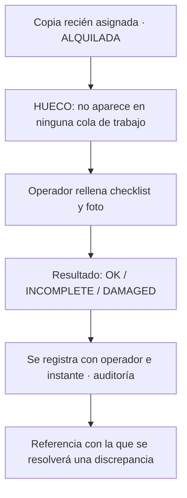

**Estado: solo API.** Y es el gemelo de S4: el registro de condición es la prueba
con la que se defiende al suscriptor. Sin las dos pantallas — la del operador que
registra y la del suscriptor que compara — el mecanismo entero de D8 queda inerte
aunque el backend funcione.

### O3 · Gestión de catálogo e inventario

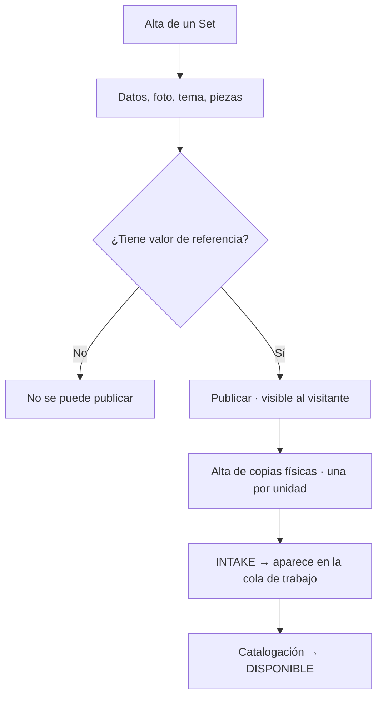

**Estado: solo API** (`POST /api/sets`, `PATCH /api/sets/:id`, `PUT
/api/sets/:id/publication`, `POST /api/sets/:id/copies`). **No existe ninguna
pantalla de gestión de catálogo en el back-office**, así que el inventario solo
puede crecer por semilla o por `curl`. Para una biblioteca de préstamo, esto es el
equivalente a no tener almacén.

### O4 · Soporte a un cliente

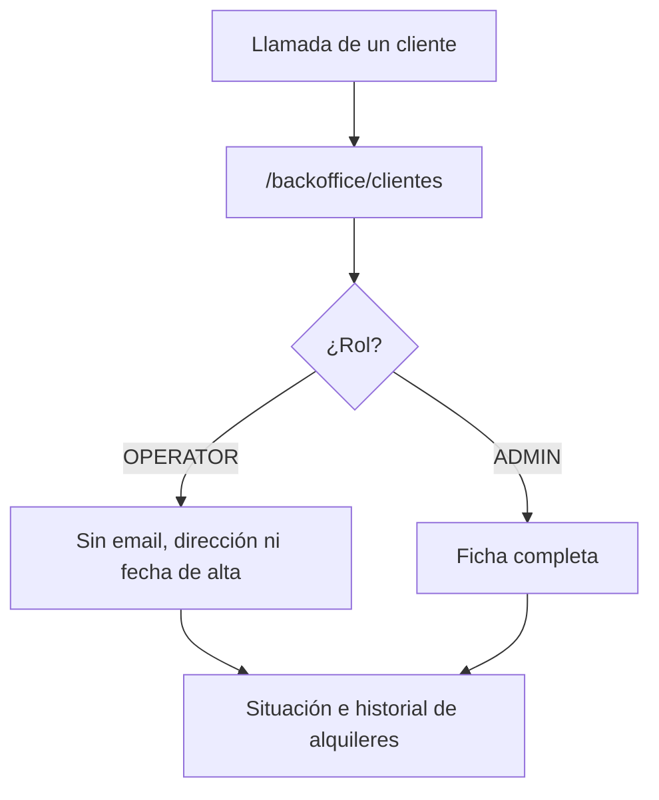

**Estado: implementado.** El recorte lo hace el caso de uso (`projectCustomer`), no
la página — así que el diseño **no puede** decidir mostrar un campo que el servidor
no envía, y eso está bien. La lista no tiene búsqueda ni filtro, lo que sirve con 5
usuarios sembrados y no con 500.

### A1 · Admin — configuración de las reglas

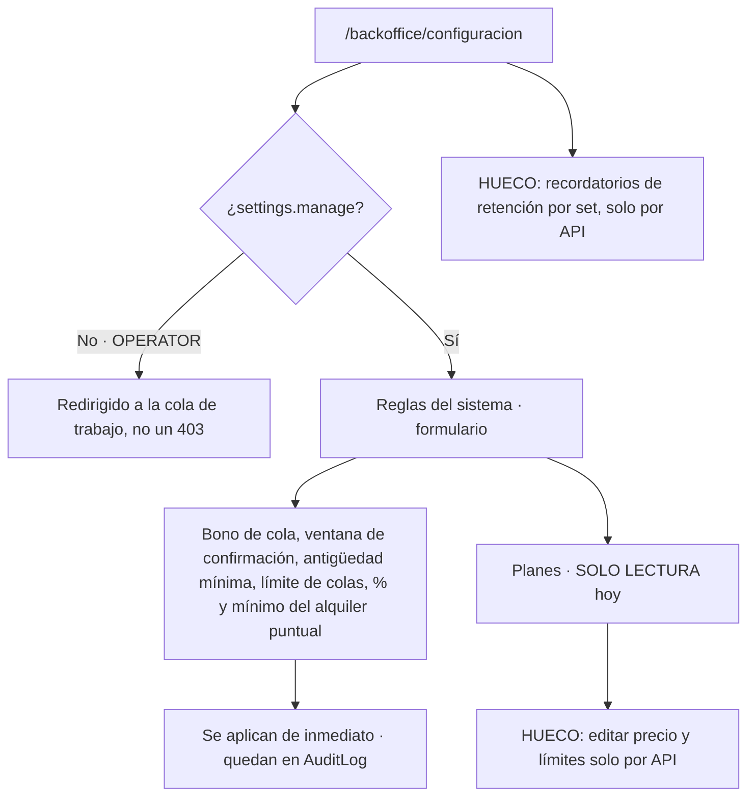

**Estado: implementado a medias.** Las reglas del sistema tienen formulario; los
planes se listan pero no se editan — la propia página lo admite por escrito. Cada
parámetro de este formulario cambia una regla de negocio que el usuario final vive
en su propia carne (cuánto dura la ventana, cuántos días de ventaja da el premium):
merece explicación en línea, no solo una etiqueta.

### A2 · Admin — personal

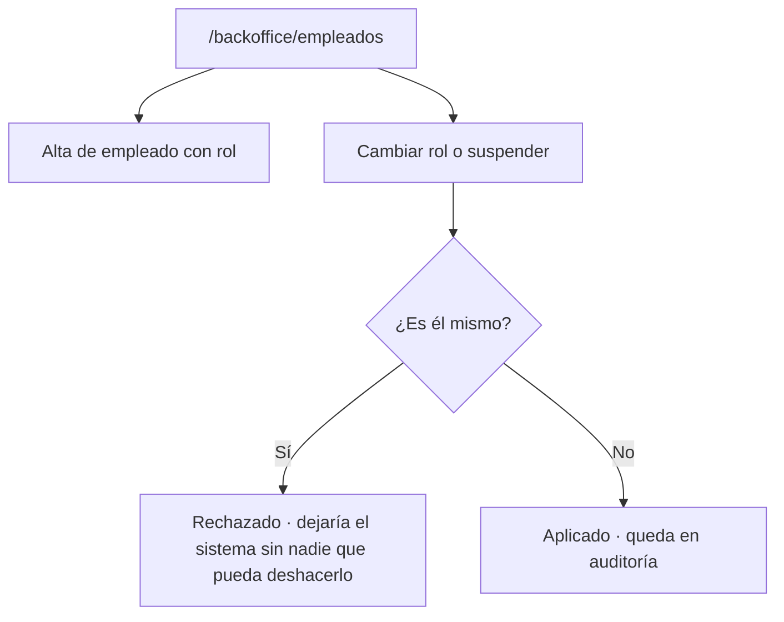

**Estado: implementado.** La autoprotección del admin es una regla que conviene
explicar en la interfaz *antes* del intento, no como error después.

> **Corrección del 2026-09-06.** Este flujo daba el alta por hecha, y solo lo estaba a
> medias: `POST /api/employees` existía con su permiso y su auditoría desde el bloque
> 8, pero la pantalla no tenía formulario — crear un operador exigía llamar al endpoint
> a mano. Ya lo tiene. Dice además lo que la API no puede decir: que la contraseña
> inicial hay que **entregarla en persona**, porque no se manda ningún correo.

---

## 6. El sistema como actor invisible

El scheduler no tiene pantalla, pero **es el origen de casi todo lo que el usuario
recibe sin pedirlo**. Diseñar los avisos es diseñar este actor.

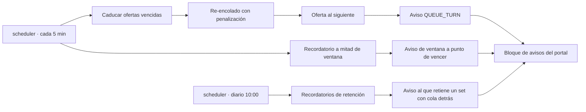

Cada aviso lleva una `dedupeKey` y un índice único que **impide el duplicado a nivel
de base de datos**: el diseño puede asumir que un aviso aparece una sola vez, sin
lógica de deduplicación en pantalla. La excepción deliberada es
`RETENTION_REMINDER`, que lleva el ciclo en la clave porque *debe* repetirse.

---

## 7. Cobertura: historia → flujo → pantalla

| HU | Historia | Flujo | Pantalla | Estado |
|---|---|---|---|---|
| HU-00 | Explorar como visitante | V1 | `/catalogo`, `/catalogo/:id`, `/planes` | 🟢 desde 2026-08-20 |
| HU-01 | Alta de suscriptor, con plan | V2 | `/registro` | 🟢 desde 2026-08-17 |
| HU-02 | **Cambiar** de plan | S5 | `/portal/suscripcion` | 🟢 desde 2026-08-17 |
| HU-03 | Solicitar un set ⭐ | S1 | `/catalogo/:id` | 🟢 desde 2026-08-20 |
| HU-04 | Unirse a la cola ⭐ | S1 | `/catalogo/:id` | 🟢 desde 2026-08-20 |
| HU-05 | Confirmar o rechazar oferta ⭐ | S2 | `/portal` | 🟢 |
| HU-06 | Mis sets, historial y posición | S6 | `/portal/sets`, `/portal/historial` | 🟢 desde 2026-08-21 |
| HU-07 | Reportar discrepancia | S4 | `/portal/sets` | 🟢 desde 2026-08-20 |
| HU-08 | Iniciar devolución ⭐ | S3 | `/portal/sets` | 🟢 |
| HU-09 | Cancelar o pausar | S5 | `/portal/suscripcion` | 🟢 desde 2026-08-20 |
| HU-10 | Dar de alta una copia | O3 | `/backoffice/catalogo/:id` | 🟢 desde 2026-08-20 |
| HU-11 | Registrar condición ⭐ | O2 | `/backoffice/copias/:id/entrega` | 🟢 desde 2026-08-20 |
| HU-12 | Recepcionar e inspeccionar | O1 | `/backoffice` | 🟢 |
| HU-13 | Higienizar ⭐ | O1 | `/backoffice` | 🟢 |
| HU-14 | Marcar incompleta | O1 | `/backoffice` | 🟢 |
| HU-15 | Baja de copia (admin) | O1 | `/backoffice` | 🟢 |
| HU-16 | Configurar reglas | A1 | `/backoffice/configuracion`, ficha de set | 🟢 desde 2026-08-21 |
| HU-17 | Equidad de la cola | Sistema | — | 🟢 sin UI por diseño |

**Resumen: 18 de 18 historias tienen recorrido completo por interfaz**, y las **seis ⭐**
con ellas. HU-17 sigue sin pantalla a propósito: es el motor de equidad de la cola, y lo
que se ve de él es el puesto que ocupa cada suscriptor en "Mis colas".

> **Corregido el 2026-08-20.** La primera versión de esta tabla se escribió el 16 de
> agosto, un día antes de implementar `plan-obligatorio-en-alta`, y daba HU-01 como
> incompleta y HU-02 como "sin API ni UI". Las dos están hechas desde el 17: el alta crea
> la suscripción en la misma transacción y el portal tiene `PlanSwitcher` sobre
> `PUT /api/subscriptions/me`. HU-09 (pausar/cancelar) sí sigue siendo solo API.
> Y el 20 de agosto **W1 se construyó**: `/catalogo/:id` existe, así que HU-00, HU-03 y
> HU-04 pasan a verde. Con las cuatro pantallas que faltan, esto llegaría a **16 de 18**
> y **6 de 6** ⭐ — [`wireframes.md`](wireframes.md) §9.4.
>
> **Puesta al día el 2026-08-21.** Las cinco pantallas de los wireframes se construyeron
> el 20 de agosto —W1 a W5— y el 21 llegaron las dos que quedaban a medias: la **posición
> en cola** en "Mis colas" (§8.4 de los wireframes) cierra HU-06, y la pantalla de
> **planes y recordatorios de retención** cierra HU-16. La tabla de arriba ya refleja
> ambas; las columnas de pantalla también, que habían envejecido con el reparto de rutas
> de W5.

Cuando el MVP se dio por cerrado, esto era coherente — el criterio de éxito era el
**circuito E2E demostrable**, y el E2E lo recorre entero mezclando interfaz y API.
Traducido a producto, en cambio, quedaba corto: **no se podía ser cliente de Clickoteca
usando solo el navegador**. Desde el 20 de agosto sí se puede, y desde el 21 no queda
ninguna historia que dependa de llamar a la API a mano.

---

## 8. Qué hay que decidir antes de dibujar pantallas

### 8.1 · Decidido — el alta lleva plan y el alquiler puntual sale (2026-08-16)

El hueco que bloqueaba a todos los demás está resuelto por decisión del propietario:

- **La elección de plan entra en el alta (HU-01).** No existe "cuenta sin plan": el
  alta crea usuario, dirección, método de pago **y suscripción** en la misma
  transacción. Se acaba el callejón del flujo V2.
- **HU-02 pasa a ser *cambio* de plan**, siempre entre BASIC y PREMIUM, sobre una
  suscripción existente. Inmediato al subir; al bajar, **rechazado mientras tenga
  más sets fuera de los que permite el plan nuevo** — el mismo criterio que ya rige
  para cancelar, y por la misma razón: la regla se cae del límite de plazas, no es
  una comprobación aparte.
- **El alquiler puntual sin suscripción sale del alcance.** Alquilar exige plan.

Esto simplifica de golpe la pantalla de alta (dos opciones, no tres), la ficha de
set (un solo camino de solicitud, no dos precios distintos), la configuración del
admin (desaparecen el % y el mínimo del puntual) y la de planes.

**Ojo — no es solo documentación.** La decisión deja código vivo sin uso
(`checkOneOffEligibility`, `computeOneOffPrice`, la bifurcación de `requestSet` y
dos `SystemSetting`) y contradice un Requirement de `specs/subscriptions`. Retirarlo
es un cambio de comportamiento y debe pasar por una propuesta OpenSpec, no por un
borrado silencioso. Las columnas de base de datos (`Rental.subscriptionId` opcional,
`Payment`) pueden quedarse: no estorban y quitarlas cuesta una migración.

### 8.2 · Lo que sigue abierto

Ordenado por lo que bloquea a lo demás.

1. ~~**La ficha de set `/catalogo/:id`.**~~ **Dibujada (2026-08-20)**:
   [`wireframes.md`](wireframes.md) §3 (W1), con sus cuatro estados —visitante,
   elegible, sin copias y los cuatro motivos de no elegibilidad—.
2. ~~**El par condición/discrepancia (O2 + S4).**~~ **Dibujado (2026-08-20)**:
   `wireframes.md` §4 y §5 (W2 y W3). Salió de ahí que el suscriptor **no puede tener
   un botón de "Todo correcto"**: la conformidad tácita no se persiste a propósito, así
   que ese botón no llamaría a nada.
3. ~~**Alcance del back-office de catálogo (O3).**~~ **Decidido (2026-08-20)**,
   `wireframes.md` §2.1: **lista + ficha de set con su inventario**, y **sin endpoint
   nuevo**. La API completa ya existe, así que la versión recortada no ahorraría
   backend; y sin lista no hay forma de llegar a un set no publicado, que es como nace
   todo set.
4. ~~**Dónde vive "mi suscripción".**~~ **Decidido (2026-08-20)**, `wireframes.md`
   §2.2: **pantalla propia `/portal/suscripcion`**, con el resumen enlazando desde
   `/portal`. Ahí tienen que caber pausar, cancelar y reactivar, y cancelar no puede
   ser un botón más en una lista de bloques.
5. ~~**Lenguaje visual de los estados.**~~ **Resuelto (2026-08-19)** en
   [`design-system.md`](design-system.md) §5: vocabulario único en `lib/status.ts`,
   con etiqueta y tono **por superficie** —el operador ve el estado exacto, el
   suscriptor ve en qué punto está lo suyo— y una prueba contra `schema.prisma` que
   impide que un estado nuevo llegue a pantalla sin traducir.
6. ~~**Vacíos, errores y esperas.**~~ **Pauta fijada** en `design-system.md` §7. Sigue
   abierta su aplicación pantalla a pantalla; lo que sí se corrigió ya es que los
   errores usaban un rojo ajeno al tema que en modo oscuro no llegaba a AA.
7. ~~**Navegación del portal.**~~ **Decidido (2026-08-20)**, `wireframes.md` §2.3: la
   navegación entra en `app/(portal)/portal/layout.tsx` —que ya existe— con cinco
   destinos: Resumen · Mis sets · Historial · Suscripción · Avisos. Cabecera y no
   `tabs`, porque son rutas de verdad. Al dibujarlo se vio que **la navegación del
   back-office vive dentro de `backoffice/page.tsx`**, así que en `/backoffice/clientes`
   no está y hay que volver al centro para saltar a otra sección; sube al layout por el
   mismo motivo.

**Con esto, §8.2 queda cerrado entero.**

---

## 9. Próximo paso propuesto

Con los flujos cerrados, el orden natural es:

1. ~~**Sistema de diseño**~~ — **hecho (2026-08-19)**:
   [`design-system.md`](design-system.md). Paleta OKLCH con croma y contrastes
   medidos, tipografía y ritmo, cinco tonos de estado y el vocabulario del punto 8.5.
   No es solo documento: está en `app/globals.css` y `lib/status.ts`, aplicado al
   portal y al back-office, y sostenido por dos pruebas.
2. ~~**Wireframes**~~ — **hechos (2026-08-20)**: [`wireframes.md`](wireframes.md), las
   cinco pantallas (ficha de set, registro de condición, discrepancia, catálogo de
   back-office y portal ampliado) con su disposición, sus datos, sus errores reales y
   sus vacíos. Cierra además los tres puntos que quedaban de §8.2 y destapa **siete
   huecos de implementación** (§8 de ese documento), dos de ellos bloqueantes.
3. **Implementación** superficie a superficie, en el orden de `wireframes.md` §9.2:
   W1 → los dos `layout.tsx` → W5 → W2+W3 → W4. Trayendo los componentes de shadcn que
   faltan (hoy hay `button` y `badge`; la lista está en `design-system.md` §6.2, ampliada
   en `wireframes.md` §9.1). ← **siguiente**
4. ~~**Verificación de accesibilidad**~~ — **hecho (2026-08-19)**: además del
   contraste y el foco, que ya se median solos (`tests/design-tokens.test.ts`),
   `e2e/accesibilidad.spec.ts` pasa **axe** con las etiquetas WCAG 2.1 A/AA por las
   nueve pantallas y sale limpio. Queda fuera de su alcance lo que axe no ve: el
   recorrido por teclado del back-office y si los textos alternativos describen algo.
