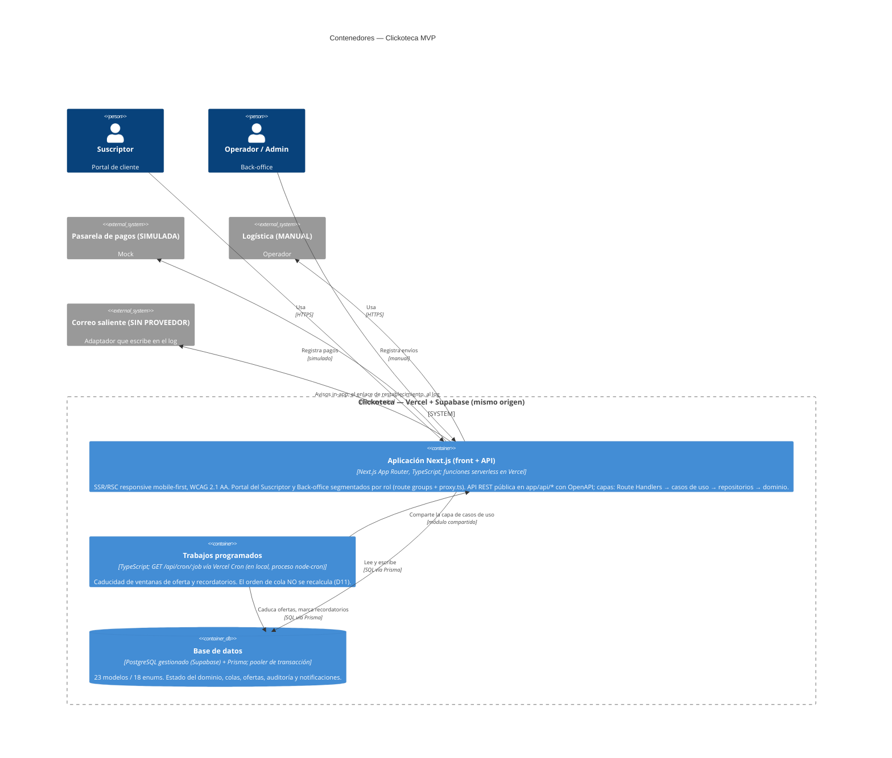
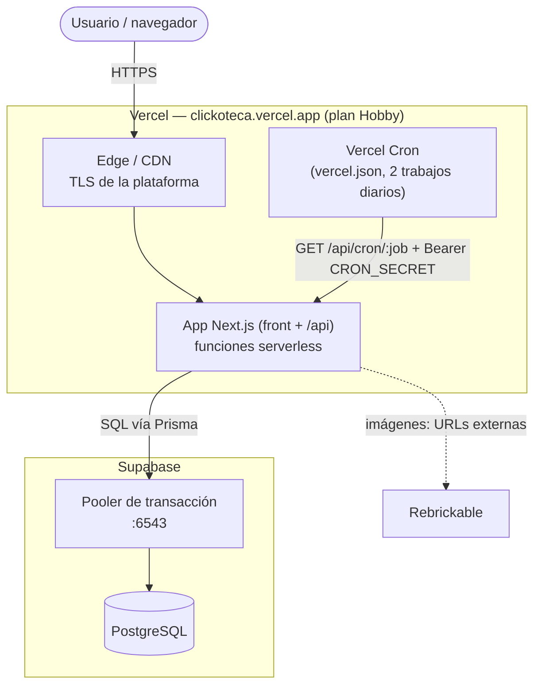

## Índice

0. [Ficha del proyecto](#0-ficha-del-proyecto)
1. [Descripción general del producto](#1-descripción-general-del-producto)
2. [Arquitectura del sistema](#2-arquitectura-del-sistema)
3. [Modelo de datos](#3-modelo-de-datos)
4. [Especificación de la API](#4-especificación-de-la-api)
5. [Historias de usuario](#5-historias-de-usuario)
6. [Tickets de trabajo](#6-tickets-de-trabajo)
7. [Pull requests](#7-pull-requests)

---

## 0. Ficha del proyecto

### **0.1. Nombre completo: Xavier Vergés Marín**

### **0.2. Nombre del proyecto: **

Clickoteca

### **0.3. Descripción breve del proyecto:**

**Clickoteca** es una *biblioteca de sets de Lego por suscripción*: el
suscriptor recibe un set, lo disfruta y lo devuelve para pedir otro. Este PRD
cubre el **MVP**: el circuito completo end-to-end (suscripción → selección →
cola de reservas → alquiler → devolución → inspección → higienización → vuelta
a circulación), tanto desde la cara del **suscriptor** como desde el
**back-office** (operadores + admin).

### **0.4. URL del proyecto:**

**Aplicación desplegada: https://clickoteca.vercel.app**

Corre en **Vercel** (plan Hobby) con **Supabase Postgres** — ver §2.4 y
`documents/ADR-0003`. Comprobación rápida de que está en pie:
`GET https://clickoteca.vercel.app/api/health` devuelve
`{"status":"ok","service":"clickoteca"}`.

> **Las credenciales de la instancia desplegada no se publican aquí** (este
> repositorio es público): se entregan por el canal del curso. Las cuentas de
> ejemplo de §1.4, con la contraseña `clickoteca`, son **las de tu entorno local**.

Repositorio: https://github.com/xaviverges/AI4Devs-finalproject-xvm/tree/project-xvm

### 0.5. URL o archivo comprimido del repositorio

Repositorio público en GitHub: https://github.com/xaviverges/AI4Devs-finalproject-xvm
(rama de trabajo `project-xvm`).


---

## 1. Descripción general del producto

> Describe en detalle los siguientes aspectos del producto:

### **1.1. Objetivo:**

Los sets de Lego son caros, se montan una vez y luego ocupan espacio: coste +
almacenamiento + "ya me aburrí". **Clickoteca** resuelve ese dolor con un modelo
de **biblioteca por suscripción**: el usuario paga una cuota mensual para
disfrutar sets sin comprarlos ni quedárselos —los recibe, los monta, los devuelve
y pide el siguiente—.

- **Para quién:** aficionados al Lego (adultos) que quieren rotar sets sin
  acumularlos, y el equipo de **back-office** (operadores y admin) que gestiona el
  inventario físico.
- **Valor aportado:** acceso rotativo a un catálogo curado a cambio de una cuota,
  con una **cola de reservas justa** (la espera pesa más que el dinero) y un
  circuito operativo que garantiza que cada copia vuelve inspeccionada e
  higienizada a circulación.

> El alcance de este entregable es el **MVP**: el circuito end-to-end completo
> (suscripción → selección → cola → alquiler → devolución → inspección →
> higienización → vuelta a circulación) desde la cara del suscriptor y la del
> back-office. Pagos, logística y correo saliente son **non-goals** y quedan
> simulados/manuales.

### **1.2. Características y funcionalidades principales:**

- **Acceso público del visitante:** un usuario sin sesión explora una
  **proyección pública** del catálogo (sets publicados, foto, nº de piezas, tema,
  dificultad), consulta los planes y puede darse de alta. La **disponibilidad** y
  todo lo de nivel copia/cola exigen login.
- **Alta y suscripción:** registro con declaración de mayoría de edad, tarjeta
  (simulada), dirección de envío obligatoria, aceptación de condiciones y
  **elección de plan** —**BASIC** (1 set simultáneo) o **PREMIUM** (hasta 2 + bono
  de cola)—, todo en la misma transacción: no existe la cuenta sin plan. El plan se
  puede cambiar después (`BASIC ⇄ PREMIUM`), y bajar exige haber devuelto los sets
  que no quepan en el nuevo. **Alquilar exige plan activo**: el alquiler puntual sin
  suscripción salió del alcance el 2026-08-16.
- **Recuperación del acceso:** quien olvida su contraseña pide desde el login un
  enlace a la dirección de su cuenta — un solo uso, caducidad de **1 hora**, y al
  gastarse se **cierran todas las sesiones abiertas**. La respuesta es la misma exista
  o no la cuenta, para no revelar quién está dado de alta. Sin MFA. El transporte de
  correo del MVP **escribe el mensaje en el log** (ver §2.5).
- **Catálogo e inventario en dos niveles:** **Set** (modelo de catálogo, no
  publicable sin valor de referencia) vs. **Copia** (unidad física con su propio
  ciclo de vida de 9 estados: `INTAKE → DISPONIBLE ⇄ OFRECIDA → ALQUILADA →
  EN_DEVOLUCION → EN_INSPECCION → EN_HIGIENIZACION`, con ramas a `INCOMPLETA` y
  `BAJA`).
- **Sets por antigüedad, a la vista:** los sets restringidos se señalan en el
  catálogo con la antigüedad que exigen —también al visitante: es un atributo del set,
  no inventario— y la ficha dice **desde cuándo** podrá llevárselo quien mira. No se
  ocultan: la antigüedad es un premio por seguir suscrito, y esconderla no la motiva.
- **Solicitud de sets y cola de reservas justa:** si hay copia disponible se
  asigna directa; si no, el suscriptor entra en una cola ordenada por **prioridad
  aditiva** (antigüedad de espera + bono de plan, nunca multiplicativa) — la
  espera siempre puede superar la ventaja premium.
- **Ofertas con ventana de confirmación:** al liberarse una copia se ofrece al
  cabeza de cola elegible; el suscriptor acepta, rechaza (pasa al instante al
  siguiente) o la deja caducar (con recordatorio a mitad de ventana → vuelve al
  final con prioridad reducida, no se le expulsa).
- **Registro de condición y devolución:** el operador documenta el estado de la
  copia (checklist/foto) antes de enviarla; el suscriptor puede reportar
  discrepancia en la entrega sin que se le impute. La devolución pasa por
  **inspección** e **higienización** como **dos pasos separados** antes de volver
  a circulación.
- **Historial del suscriptor ("Mis sets"):** sets en préstamo, histórico de
  alquileres pasados y posición en cada cola activa.
- **Cancelación (camino feliz):** solo cuando no se tiene ninguna copia en poder y
  no hay devoluciones ni saldo pendientes.
- **Back-office y administración:** gestión del ciclo de vida de las copias
  (alta, recepción, inspección, higienización, marcado de incompletas/dañadas),
  con **baja de copias exclusiva de admin**, **gestión del personal** (alta de
  operadores y admins, cambio de rol y suspensión — solo admin) y configuración de
  reglas
  (precios, bono de cola, ventana de confirmación, antigüedad mínima, límite de
  colas, recordatorios de retención). **Auditoría quién/cuándo** en toda
  transición de estado y acción administrativa.

### **1.3. Diseño y experiencia de usuario:**

> **Tres entregables cerrados y construidos:**
>
> 1. **Flujos por rol** — [`documents/ux-flows.md`](documents/ux-flows.md): actores y
>    superficies, mapa de navegación, 15 diagramas Mermaid de flujo y la tabla de
>    cobertura historia → flujo → pantalla. De ahí salió la decisión de alcance de
>    que el plan entra en el alta y el alquiler puntual sale.
> 2. **Sistema de diseño** —
>    [`documents/design-system.md`](documents/design-system.md): paleta en OKLCH con
>    contrastes medidos, tipografía y ritmo, los cinco tonos de estado y el
>    vocabulario que traduce los estados del dominio a lo que ve cada rol.
>    Implementado en `app/globals.css` + `lib/status.ts`, y **verificado en la suite**
>    (`tests/design-tokens.test.ts` mide el contraste contra el CSS real).
> 3. **Wireframes** — [`documents/wireframes.md`](documents/wireframes.md): las cinco
>    pantallas que entonces solo existían como API (ficha de set, registro de condición,
>    discrepancia, catálogo de back-office y portal ampliado), con su disposición,
>    de dónde sale cada dato, los errores reales de la API y qué se ve cuando no hay
>    nada. Dibujarlas contra el código destapó siete huecos de implementación, dos
>    bloqueantes.
>
> **Construida ya la primera**, la ficha de set `/catalogo/:id` (2026-08-20): con ella
> el catálogo deja de ser una rejilla sin destino y **HU-00, HU-03 y HU-04 pasan a
> verde** — solicitar un set y entrar en la cola ya se hacen desde el navegador.
>
> Y con ella, la **navegación de superficie** (`wireframes.md` §2.3 y §8.5): los
> destinos de cada superficie se declaran en `lib/navigation.ts` —filtrados por la
> matriz de permisos— y se pintan desde el layout, así que cada superficie se recorre de
> una sección a otra sin volver al centro.
>
> **Construida W4** (`wireframes.md` §6, 2026-08-20): el **catálogo e
> inventario del back-office**, con su lista —que incluye los sets **sin publicar**, los
> únicos a los que no se llega por ninguna otra puerta— y la ficha con el alta, la
> edición, la publicación y las copias de cada set. **HU-10 pasa a verde**: dar de alta
> un set, tasarlo, publicarlo y ponerle copias ya se hace desde el navegador.
>
> **Y W5** (`wireframes.md` §7, 2026-08-20): el **portal ampliado**, repartido en sus
> cinco rutas —resumen, mis sets, historial, suscripción y avisos— con la barra de
> navegación y su contador de avisos sin leer. **HU-09 pasa a verde**: pausar, cancelar
> y reactivar tenían API desde el principio y ningún sitio donde pulsarlas. Con ella,
> **14 de 18** historias tienen recorrido completo por interfaz.
>
> **Y W2+W3** (`wireframes.md` §4 y §5, 2026-08-20), las dos últimas y juntas, porque el
> par condición → discrepancia solo tiene sentido completo: el operador **registra el
> estado de la copia antes de enviarla** —con la lista de comprobación ratificada y sus
> observaciones— y la suscriptora, mientras la ventana está abierta, ve **contra qué se
> compara** lo que ha recibido y puede avisar de que algo no coincide sin que se le
> impute nada. **HU-11 y HU-07 pasan a verde**, y con ellas **las seis ⭐ distintivas del
> producto**: **16 de 18** historias tienen recorrido completo por interfaz y **las cinco
> pantallas de los wireframes están construidas**.
>
> **Y las dos que quedaban a medias, cerradas el 2026-08-21** (`wireframes.md` §8.4 y
> §10). **HU-06**: "Mis colas" abre cada línea con el puesto —"2.º de 5"—, que hasta
> ahora solo se veía entrando en la ficha de cada set; el puesto lo calcula el dominio
> con el **mismo orden que sirve las ofertas**, no una cuenta aparte en SQL. **HU-16**:
> los planes se editan desde `/backoffice/configuracion` —precio, sets simultáneos y
> ventaja en cola, los tres en una sola llamada auditada— y los recordatorios de
> retención se activan **set a set** desde su ficha del catálogo, que es donde el
> endpoint los tiene. Construirla destapó además un mando que no estaba conectado:
> `premiumQueueBonusDays` era un ajuste del sistema que **no leía nadie** —la ventaja
> sale del plan— y se ha retirado. Con esto, **18 de 18** historias tienen recorrido
> completo por interfaz.
>
> **Desplegado el 2026-08-21/22** en **https://clickoteca.vercel.app** (Vercel +
> Supabase, `documents/ADR-0003`), y con eso **el videotutorial se retira como
> entregable** (2026-09-06): la revisión se hace sobre la aplicación real —con las
> credenciales que se entregan por el canal del curso, ver §0.4—, donde las 18
> historias se recorren por el propio pie de quien corrige en vez de por el camino
> que una grabación hubiera elegido enseñar (`documents/PRD.md` §9).
>
> La navegación funcional está definida como casos de uso (PRD §14) y como historias
> de usuario (`documents/user_stories.md`, resumidas en §5). Objetivos transversales
> de UX ya fijados: **responsive mobile-first** y **accesibilidad WCAG 2.1 AA**
> (EN 301 549 / European Accessibility Act) — el contraste y el foco se comprueban
> solos contra el CSS real, y **`axe` audita diecinueve pantallas** (las cinco públicas, la
> ficha de set en sus dos proyecciones, las cinco del portal, las cinco del back-office,
> la ficha de catálogo y el registro de entrega) más **tres diálogos abiertos** —alta de
> set, cancelación de suscripción y aviso de discrepancia—, en el E2E y con las
> etiquetas WCAG 2.1 A/AA.

### **1.4. Instrucciones de instalación:**

> **Estado actual del repositorio.** El MVP está **completo y desplegado**: las 45
> tareas hechas, las **18 de 18 historias** con recorrido por interfaz y la aplicación
> en marcha en <https://clickoteca.vercel.app> (§0.4). Los pasos de abajo levantan el
> mismo sistema en local, con una base sembrada que ya trae meses de operación a la
> espalda.

Requisitos: **Node.js 22.22+** (Next 16 admite 20.9+, pero Testcontainers 12 —
usado en los tests de integración — exige ≥22.22), **Docker** (para el Postgres
local) y **npm**. La base de datos es **PostgreSQL 16**; el ORM es **Prisma 7**,
que configura la URL de conexión en `prisma.config.ts` (no en el `datasource` del
`schema.prisma`).

```bash
# 1. Clonar e instalar dependencias
git clone https://github.com/xaviverges/AI4Devs-finalproject-xvm
cd AI4Devs-finalproject-xvm
npm install

# 2. Variables de entorno
cp .env.example .env        # ajustar si hace falta; DATABASE_URL ya apunta al Postgres de Docker

# 3. Levantar PostgreSQL en local (ver detalle más abajo)
docker compose up -d

# 4. Aplicar el esquema y generar el cliente Prisma
npm run db:migrate          # crea las tablas a partir de schema.prisma
npm run db:generate         # genera el cliente tipado en src/generated/prisma

# 5. Semillas: catálogo, planes, parámetros y usuarios de prueba
npm run db:seed             # idempotente: se puede relanzar sin duplicar nada

# 6. Levantar la app Next.js full-stack + el scheduler
npm run dev                 # front (SSR/RSC) + API REST en /api → http://localhost:3000
npm run scheduler           # proceso Node aparte (node-cron), en otra terminal
```

Comprobación rápida de que todo está en pie: `GET http://localhost:3000/api/health`
debe devolver `{"status":"ok"}`.

#### Datos de prueba

`npm run db:seed` deja el entorno listo para trastear: los 2 planes de §D9, los 5
parámetros configurables del sistema, **35 sets reales** del dataset público de
Rebrickable con sus temas, **66 copias**, **13 cuentas** y un **historial de nueve
meses de operación** — 29 alquileres con sus devoluciones, inspecciones, envíos e
incidencias.

**El personal:**

| Cuenta | Rol | Situación |
| --- | --- | --- |
| `admin@clickoteca.test` | ADMIN | Configuración, bajas de copia y gestión de personal |
| `operador@clickoteca.test` | OPERATOR | Olga Operadora — cola de trabajo del back-office |
| `operador2@clickoteca.test` | OPERATOR | Marc Oliva — el segundo turno; los informes de condición se reparten entre los dos |

**Los diez suscriptores**, elegidos para cubrir los dos planes, los tres estados de
una suscripción y antigüedades de uno a diez meses:

| Cuenta | Plan | Antigüedad | Situación ahora mismo |
| --- | --- | --- | --- |
| `ana@example.test` | Premium | 8 meses | 3 alquileres cerrados; supera la antigüedad mínima para sets restringidos |
| `bruno@example.test` | Basic | 1 mes | Un solo alquiler; **no** llega a la antigüedad mínima |
| `carla@example.test` | Basic | 6 meses | Suscripción **cancelada** — no puede alquilar |
| `diego@example.test` | Premium | 10 meses | El cliente más antiguo: 4 cerrados, uno de ellos ganado en la cola; **2 plazas ocupadas** |
| `elena@example.test` | Basic | 7 meses | Una devolución **incompleta**: faltaban piezas, se repusieron |
| `fran@example.test` | Basic | 5 meses | Un set **adjudicado sin preparar** — la fila que espera en «Por preparar» |
| `gemma@example.test` | Premium | 4 meses | Ha pulsado «Devolver»: la copia está **en devolución** |
| `hugo@example.test` | Basic | 9 meses | Suscripción **en pausa**, sin nada fuera |
| `irene@example.test` | Premium | 6 meses | Una copia **sobre la mesa de inspección** y otra que acabó de **baja** por daño |
| `jorge@example.test` | Basic | 3 meses | En cola con **penalización**: dejó caducar una oferta |

Contraseña común: `clickoteca`. **Es la de tu entorno local y solo la de tu entorno
local**, y está escrita aquí porque este repositorio es público: quien clone y siembre
su propia base entra con ella.

> **La instancia desplegada no usa esta contraseña.** Tiene las suyas, y **no se
> publican aquí**: se entregan por el canal del curso.
>
> Son **tres, una por rol** —`SEED_PASSWORD_ADMIN`, `SEED_PASSWORD_OPERATOR` y
> `SEED_PASSWORD_SUBSCRIBER`—, y la separación no es adorno. Con un único hash para
> todas las cuentas, entregar la de un suscriptor de demostración era entregar también
> la del **administrador**, que configura el sistema, da de baja copias y gestiona al
> personal: no había forma de dar lo uno sin lo otro. Quien corrige sigue recibiendo las
> tres —media aplicación es el back-office—, pero ahora cada una abre solo lo suyo y se
> pueden rotar por separado. `SEED_PASSWORD` a secas sigue valiendo como valor común
> para los tres roles.
>
> Si vas a desplegar tu propia instancia:
> `SEED_PASSWORD_ADMIN="…" SEED_PASSWORD_OPERATOR="…" SEED_PASSWORD_SUBSCRIBER="…" npm run db:seed`.
>
> **Y lo que hay que saber antes de equivocarse:** la contraseña **se fija en la primera
> siembra**. El `upsert` de la semilla actualiza nombre y rol, **no el hash**, así que
> volver a sembrar con otra no cambia las cuentas que ya existan — y como en la base solo
> hay hashes argon2id, que no se invierten, perder esas contraseñas obliga a **resetear
> la instancia** para poder fijar otras. Guárdalas donde no se pierdan.

Las antigüedades distintas están elegidas para poder ejercitar la regla de sets
restringidos (D7) sin tocar la base a mano. La procedencia del catálogo y qué campos son
curados a mano se detallan en
[`prisma/seed-data/README.md`](prisma/seed-data/README.md).

##### El historial, y por qué se puede confiar en él

Sin pasado, la aplicación se revisa vacía: el portal dice «aún no has alquilado nada»,
la cola de trabajo del operador no tiene ninguna fila y el historial de una copia es una
sola línea. `prisma/seed-history.ts` le pone nueve meses de operación encima — 186
transiciones de estado, 52 informes de condición, 54 envíos, 2 incidencias, 3 entradas de
cola y 87 avisos — con tres reglas que lo hacen creíble en vez de decorativo:

1. **Ningún estado se escribe a mano.** Cada cambio pasa por `applyTransition`, el mismo
   camino que usa la aplicación, así que el historial de cualquier copia es un recorrido
   legal de la máquina de estados de PRD §15.5 — y los avisos salen de la misma función
   pura (`notificationsFor`) que usa el emisor real.
2. **El historial trae sus propias copias.** Las 59 de la semilla base no se tocan: las
   7 restantes las da de alta este módulo con fecha pasada, sobre sets que ya tenían dos
   o más. Es lo que permite que el E2E siga encontrando lo que busca —«un set con una
   sola copia libre», «un set con dos o más»— después de sembrar.
3. **Todo cuadra en el tiempo.** Ningún alquiler empieza antes de la suscripción que lo
   paga ni después de cancelarla, ninguna copia está en dos manos a la vez, y un set
   restringido solo lo alquila quien ya tenía la antigüedad exigida **entonces**.

El resultado deja el circuito **parado en sus cuatro puntos a la vez** —una copia
adjudicada sin preparar, otra en casa del suscriptor, otra en devolución y otra en
inspección—, de modo que el back-office tiene trabajo real desde el primer arranque. Y
un set agotado (`Hogwarts Castle`) con su cola de dos, que es la única situación en que
una cola es coherente: con una copia libre, el sistema ya la habría ofrecido.

Es idempotente como el resto de la semilla: si el historial ya está, no se duplica.

#### Base de datos local con Docker

El fichero `docker-compose.yml` de la raíz levanta **PostgreSQL 16** con las
credenciales que espera el `DATABASE_URL` de `.env.example`
(`clickoteca:clickoteca@localhost:5432/clickoteca`). El puerto se publica **solo en
`127.0.0.1`**, nunca en la IP de la máquina: la base no se expone a la red. Los datos
persisten en el volumen `pgdata`, así que sobreviven a parar y recrear el
contenedor.

> El despliegue **no** usa este Postgres: allí la base es Supabase y se llega por su
> pooler (§2.4). Este contenedor es el de desarrollo y el de los tests.

```bash
docker compose up -d        # arrancar (la primera vez descarga la imagen)
docker compose ps           # estado y healthcheck
docker compose logs -f db   # logs
docker compose stop         # parar conservando el contenedor
docker compose down         # eliminar el contenedor (los datos siguen en el volumen)
docker compose down -v      # ⚠️ eliminar TAMBIÉN el volumen: borra la base de datos
docker compose exec db psql -U clickoteca -d clickoteca   # consola SQL
```

En el día a día basta con `docker compose up -d` antes de `npm run dev`. El
servicio usa `restart: unless-stopped`, por lo que vuelve a arrancar solo al
iniciar Docker Desktop.

#### Comandos de desarrollo

| Comando | Qué hace |
| --- | --- |
| `npm run dev` | App Next.js (front + `/api`) en modo desarrollo |
| `npm run scheduler` | Proceso node-cron (recálculo de score, caducidad de ofertas, recordatorios) |
| `npm run build` / `npm start` | Build de producción y arranque del servidor |
| `npm run start:standalone` | Arranca el **paquete autónomo** (`output: standalone`) copiándole los estáticos — el artefacto que levanta el E2E; en Vercel no se usa (ver §2.4) |
| `npm run lint` / `npm run typecheck` | ESLint 9 (flat config) y `tsc --noEmit` |
| `npm test` / `npm run test:watch` | Vitest (unit + integración) |
| `npm run test:e2e` | Playwright contra el build autónomo en el puerto 3100 (requiere `npx playwright install` la primera vez y la base de datos levantada). `E2E_DEV=1` lo apunta a `next dev` |
| `npm run db:migrate` / `db:generate` / `db:seed` | Migraciones, cliente Prisma y semillas |
| `npm run db:deploy` | `prisma migrate deploy` — aplica migraciones ya creadas a una base remota (el despliegue). `db:migrate` es `migrate dev` y contra producción no se usa |
| `npm run spec:validate` | `openspec validate --all --strict` sobre las specs de `openspec/` |

---

## 2. Arquitectura del Sistema

### **2.1. Diagrama de arquitectura:**

**Patrón:** aplicación **Next.js full-stack** (App Router, TypeScript) que sirve
front (SSR/RSC) y **API REST pública** (Route Handlers en `app/api/*` + OpenAPI)
en un solo proyecto, sobre **PostgreSQL + Prisma**, con **arquitectura en capas**
(Route Handlers → casos de uso → repositorios → dominio) y unos **trabajos
programados** que comparten esa misma capa. Todo se despliega en **Vercel** —front
y `/api` en el mismo origen— con **Supabase Postgres** detrás. El detalle está en
`documents/C4-architecture.md` (C4 niveles 1–3), en `documents/ADR-0001`
(arquitectura) y en `documents/ADR-0003` (hosting).



**Por qué esta arquitectura y sus trade-offs**

- **Next.js unifica front + API** en un proyecto y un despliegue, coherente con el
  hosting **mismo-origen**: sin CORS y con cookie de sesión *first-party*. Se
  descartó un split SPA + API separada (dos despliegues, multi-origen).
- **Dominio agnóstico del framework:** la máquina de estados de la copia y la
  política de cola viven en una capa TS pura, testable sin levantar el servidor.
  Habilita el criterio de éxito del MVP: **cobertura de caminos de error**.
- **Trabajos programados fuera del proceso web** porque el modelo multi-instancia
  de Next duplicaría un cron in-process. En Vercel no hay proceso de vida larga, así
  que el reloj lo pone el cron de la plataforma sobre `GET /api/cron/:job`; el
  proceso `node-cron` de `scheduler/` sigue sirviendo en local.
- **Sacrificios:** la plataforma impone su ritmo — **crons diarios** en el plan
  Hobby (la caducidad de ofertas se vuelve imprecisa) y un **presupuesto de
  conexiones** a la base, que en un servidor propio no existiría (`ADR-0003`).

### **2.2. Descripción de componentes principales:**

| Componente | Tecnología | Responsabilidad |
|---|---|---|
| **Aplicación Next.js (front + API)** | Next.js App Router, TypeScript | Sirve el front SSR/RSC (Portal del Suscriptor + Back-office segmentados por rol con route groups + `proxy.ts`) y la API REST pública en `app/api/*`. |
| **Capa HTTP (Route Handlers)** | Next `app/api/*` + **Zod** + OpenAPI | Enrutado, validación de request/response contra el contrato OpenAPI (Zod alimenta el spec) y serialización. |
| **Auth y autorización** | `proxy.ts` server-side (Next 16; antes `middleware`) | Sesión por cookie y control de acceso por rol (`SUBSCRIBER/OPERATOR/ADMIN`) — la frontera de seguridad real. |
| **Casos de uso (Application)** | TypeScript puro | Una porción por capability: cuentas, catálogo, suscripciones, alquileres/devoluciones, cola, notificaciones. |
| **Dominio** | Entidades + políticas TS | Máquina de estados de la Copia (9 estados), política de cola aditiva con entrada efectiva inmutable, elegibilidad y auditoría. |
| **Repositorios** | Prisma | Acceso a datos por agregado; encapsula Prisma tras interfaces. |
| **Scheduler** | Node + node-cron | Caducidad de ofertas y recordatorios; reutiliza los mismos casos de uso. |
| **Adaptadores de infra** | Mocks / manual / log | Pagos simulados, logística manual, avisos in-app y un puerto `Mailer` (`src/mail/`) cuyo único adaptador escribe el correo en el log. |
| **Base de datos** | PostgreSQL + Prisma | 23 modelos / 18 enums; incluye las tablas de sesiones y de enlaces de restablecimiento. |

### **2.3. Descripción de alto nivel del proyecto y estructura de ficheros**

El repositorio nació **documentation-first** (specs y modelo de datos antes que
código) y hoy aloja además la app Next.js en la **raíz** — no hay carpeta
`backend/`: el proyecto full-stack *es* el repositorio.

```
AI4Devs-finalproject-xvm/
├── README.md                 # Este entregable
├── AGENTS.md                 # Memoria y acuerdos de trabajo del proyecto
├── prompts.md                # Log de prompts de la generación asistida
├── docker-compose.yml        # PostgreSQL 16 local para desarrollo
├── app/                      # Next.js App Router
│   ├── (public)/             # Landing pública
│   ├── (portal)/portal/      # Portal del Suscriptor
│   ├── (backoffice)/backoffice/   # Back-office (operador/admin)
│   ├── api/                  # Route Handlers REST (health + endpoints de dominio)
│   ├── layout.tsx
│   └── globals.css           # Tailwind v4, config CSS-first
├── proxy.ts                  # Auth/autorización por rol (Next 16 renombró middleware→proxy)
├── src/
│   ├── domain/               # Entidades y políticas TS puras (auth, máquina de estados, cola)
│   ├── use-cases/            # Casos de uso por capability
│   ├── repositories/         # Acceso a datos por agregado (encapsula Prisma)
│   ├── http/                 # Adaptador HTTP: contrato RFC 9457, cookie y contexto de sesión
│   ├── db/prisma.ts          # Cliente Prisma singleton (driver adapter pg)
│   └── generated/prisma/     # Cliente Prisma generado (gitignored)
├── components/               # De producto (`surface-nav`, `status-badge`, `backoffice/`) …
│   └── ui/                   # … y shadcn/ui (button, badge, card, dialog, input, label)
├── lib/                      # Presentación: `status.ts`, `navigation.ts`, helper `cn`
├── scheduler/index.ts        # Proceso node-cron aparte
├── prisma/
│   ├── schema.prisma         # Modelo de datos ejecutable (23 modelos / 18 enums)
│   ├── migrations/           # Historial de migraciones SQL
│   ├── seed.ts               # Semillas idempotentes
│   └── seed-data/sets.json   # Catálogo semilla (subconjunto de Rebrickable)
├── prisma.config.ts          # URL de conexión (requisito de Prisma 7)
├── tests/ · e2e/             # Vitest (unit/integración) · Playwright (E2E)
├── documents/
│   ├── PRD.md                # PRD completo (incluye §15 modelo de datos)
│   ├── C4-architecture.md    # Diagramas C4 niveles 1–3 (Mermaid)
│   ├── ADR-0001-arquitectura-mvp.md   # Stack, capas, scheduler (§5 hosting: sustituida)
│   ├── ADR-0002-api-auth-errores.md   # Auth por sesión + contrato de errores
│   ├── ADR-0003-hosting-vercel-supabase.md  # Hosting real: Vercel + Supabase
│   ├── user_stories.md       # Historias de usuario (Gherkin) HU-00..HU-17
│   ├── ux-flows.md           # Flujos por rol (15 diagramas) + cobertura HU→pantalla
│   ├── design-system.md      # Tokens, tonos y vocabulario de estados
│   └── wireframes.md         # Las 5 pantallas que faltan, contra el código real
└── openspec/
    └── changes/clickoteca-mvp/        # Cambio OpenSpec (fuente de verdad)
        ├── proposal.md · design.md (D1–D13) · tasks.md
        └── specs/            # 6 capabilities: accounts-roles, catalog-inventory,
                              # subscriptions, rentals-returns, reservation-queue,
                              # notifications
```

La separación en `src/domain` → `src/use-cases` → `src/repositories` materializa la
**regla de dependencias** de `ADR-0001` §2–§3 (cada carpeta lleva su README): el
dominio no conoce ni a Next ni a Prisma, lo que deja barata una futura extracción
de la API a un servicio propio.

### **2.4. Infraestructura y despliegue**

**Hosting (desplegado):** **Vercel** (plan Hobby) con **Supabase Postgres**, en
**https://clickoteca.vercel.app**. La decisión está en `documents/ADR-0003`, que
**sustituye a `ADR-0001` §5** — la VM única de Oracle que ese ADR eligió y que nunca
llegó a provisionarse.



- **Mismo origen:** front y `/api` salen del mismo despliegue, así que la cookie de
  sesión sigue siendo *first-party* y no hay CORS. TLS, dominio y CDN los pone la
  plataforma: no hay reverse proxy, systemd ni firewall que administrar.
- **Despliegue por `git push`** a la rama de producción, que aquí es **`MVP-Fase-1`**
  (Vercel usa `main` por defecto, y en este repo `main` es el andamiaje del curso).
  El build es `prisma generate && next build`, porque `src/generated/prisma` no está
  versionado y en una máquina limpia no existe.
- **El paquete autónomo (`output: standalone`) se desactiva en Vercel**, donde rompe
  el build: se lleva el trazado a `.next/standalone/` y no emite
  `.next/next-server.js.nft.json`, que es el fichero con el que Vercel arma sus
  funciones. Lo decide `process.env.VERCEL` en `next.config.ts`; en local y en el E2E
  se sigue construyendo el paquete autónomo, que es también el artefacto de un
  despliegue con servidor propio.
- **Imágenes** del catálogo: `` a URLs de Rebrickable, no `next/image` ni
  ficheros locales → no hace falta almacenamiento de objetos ni disco escribible.
- **Base de datos:** Supabase usado **solo como Postgres** —sin Auth, Storage ni
  RLS, y con la **Data API desactivada**, porque las tablas que crea Prisma nacen sin
  RLS y quedarían legibles con la *anon key*, que es pública por diseño—. El detalle
  de las dos URLs, más abajo.
- **Lo que se perdió por el camino, y conviene saber:** en el plan Hobby los crons
  son **diarios** (la caducidad de ofertas se vuelve imprecisa) y en *serverless* hay
  un **presupuesto de conexiones** que en un servidor propio no existe. Los dos
  trade-offs, con sus números, en `documents/ADR-0003`.

**Los trabajos periódicos se disparan por HTTP.** El scheduler es un proceso de vida
larga y en una plataforma *serverless* eso no existe, así que en el despliegue el
disparador es `GET /api/cron/:job`, que ejecuta **los mismos trabajos**: el qué vive
en `src/use-cases/scheduler/jobs.ts` y lo comparten los dos disparadores, así que no
pueden divergir. Lo que cambia es quién mira el reloj — en local, el proceso
`npm run scheduler`.

- **Los dos trabajos** son `offers` (caducidad de ofertas + recordatorio de mitad de
  ventana, cada 5 min) y `retention` (recordatorios amables, una vez al día).
- **Candado:** `Authorization: Bearer $CRON_SECRET`, el contrato que ya emite Vercel
  Cron de serie (y que cualquier otro disparador replica con una línea). **Sin
  `CRON_SECRET` el endpoint responde 404 y no ejecuta nada**: un despliegue al que se
  le olvidó la variable no puede acabar con la URL abierta.
- **Dos ejecuciones solapadas no se bloquean** —cada invocación es un proceso
  distinto—. Lo sostiene el dominio: el cierre de oferta es un CAS. El margen conocido
  es que dos barridos a la vez podrían enviar dos veces un recordatorio, y se acepta
  antes que montar un cerrojo distribuido para un aviso amable.
- **`vercel.json` declara los dos crons.** Tres cosas que no son obvias: **el cron de
  Vercel va en UTC** (las 10:00 de Madrid son las 08:00 UTC en verano y las 09:00 en
  invierno, así que el recordatorio se desplaza con el cambio de hora); el **plan
  Hobby** admite dos crons y **solo diarios** —una expresión más frecuente **hace
  fallar el despliegue**, no lo degrada—, y además los dispara en cualquier momento
  **dentro de la hora** indicada; y hace falta un Postgres gestionado, porque ahí no
  hay `localhost` que valga.
- **Por eso los dos crons de `vercel.json` son diarios**, no cada cinco minutos: es lo
  que Hobby admite. Tiene un precio y conviene saberlo: la **caducidad de ofertas se
  vuelve imprecisa** —una ventana de 48 h puede cerrarse con casi un día de retraso, y
  el recordatorio de mitad de ventana puede llegar tarde o no llegar—. El dominio no se
  rompe (todo se decide por marcas de tiempo, no por contadores), pero la experiencia
  sí se resiente. Se recupera de dos maneras: plan de pago con `*/5 * * * *`, o dejar
  `vercel.json` como está y **disparar el endpoint desde fuera** con la cadencia real —
  cualquier cosa capaz de hacer un `curl` con la cabecera sirve, incluido el propio
  `scheduler/` corriendo en otra máquina.
- **La entrega de crons es *best effort*:** Vercel avisa de que puede saltarse una
  ejecución o repetirla. Los dos trabajos son de **reconciliación** —miran qué está
  vencido ahora, no llevan la cuenta de lo que hicieron—, así que una ejecución perdida
  se cura sola en la siguiente y una repetida no duplica nada salvo, como mucho, un
  recordatorio.

**Con la base gestionada son dos URLs y no una.** La aplicación se
conecta al **pooler de transacciones** y las **migraciones no pueden**: necesitan una
sesión estable para tomar el *advisory lock* y ejecutar DDL. Por eso `DATABASE_URL`
(pooler) es la del runtime y `DIRECT_URL` (conexión directa) la que usa el CLI de
Prisma — `prisma.config.ts` prefiere la segunda si existe. Se añade `DATABASE_POOL_MAX`
para el caso serverless, donde hay **un pool por instancia viva** y el defecto de `pg`
(diez conexiones) agota el límite del proveedor en cuanto hay tráfico: en el
despliegue va a **1**, porque el techo no lo marca la concurrencia de peticiones sino
`DATABASE_POOL_MAX` × instancias vivas, y **una instancia congelada no ejecuta
temporizadores**, así que nunca cierra su conexión ociosa. Donde hay un solo proceso
—el Postgres local del docker-compose— no se define ninguna de las dos y nada cambia.
El esquema no se toca: Postgres es Postgres.

**Y las dos cadenas necesitan `uselibpqcompat=true`.** `pg` v8.16+ interpreta
`sslmode=require` como `verify-full`, y el certificado del pooler de Supabase encadena a
una raíz que Node no trae de serie: sin ese parámetro la conexión muere con
*"self-signed certificate in certificate chain"*, y no al migrar —el motor de Prisma usa
la semántica de libpq— sino **en la aplicación**, que va por el mismo `pg` del driver
adapter. El parámetro devuelve a `require` el significado de libpq (cifra, no verifica) y
es la forma que sobrevive al cambio anunciado para `pg` v9. La alternativa estricta, si
algún día importa: descargar la CA de Supabase y usar `verify-full` con `sslrootcert`.

**Puesta en marcha de un despliegue nuevo**, por si hay que repetirla:

1. Crear el proyecto en Vercel apuntando al repositorio y fijar **Production Branch**
   (aquí, `MVP-Fase-1`).
2. Añadir la base (integración de Supabase) y definir `DATABASE_URL` a mano con la URL
   del **pooler de transacción** (`:6543`) más `uselibpqcompat=true`. Las variables
   `STORAGE_*` que crea la integración no las lee el código.
3. `DATABASE_POOL_MAX=1`, un `CRON_SECRET` largo y aleatorio, y **`APP_URL`** con la
   URL pública del despliegue: es el origen del enlace de restablecimiento de
   contraseña, y sin ella se deduce de la cabecera `Host`, que la pone quien llama.
4. Desde la máquina de desarrollo, con `DIRECT_URL` apuntando a la conexión de sesión
   (`:5432`): `npm run db:deploy` y `SEED_PASSWORD="…" npm run db:seed`. La contraseña
   **se fija en la primera siembra** (el `upsert` no actualiza el hash de una cuenta que
   ya existe).
5. Comprobar: `GET /api/health` responde `{"status":"ok"}`, y
   `curl -H "Authorization: Bearer $CRON_SECRET" .../api/cron/offers` devuelve el
   resumen del trabajo.

> **El correo de restablecimiento no sale de Vercel.** El adaptador de esta entrega
> escribe el mensaje en el log, así que el enlace se lee en los *runtime logs* del
> despliegue y en ningún otro sitio — en la base solo está su hash (§2.5). Es
> deliberado, no un olvido de configuración.

> **Si vuelve a aparecer `EMAXCONN`** (conexiones agotadas), la palanca es un
> **redespliegue**: destruye las instancias congeladas y libera de golpe los huecos que
> retenían. La causa y la aritmética, en `documents/ADR-0003`.

### **2.5. Seguridad**

Decidido en `documents/ADR-0002`:

- **Sesión server-side por cookie:** identificador opaco en cookie `httpOnly` +
  `Secure` + `SameSite=Lax`; el estado de sesión se persiste en Postgres. La
  **revocación es trivial** (se borra la sesión) — por eso no JWT.
- **Passwords con argon2id** (bcrypt como alternativa aceptable).
- **Recuperación de contraseña por correo:** enlace de un solo uso, caducidad de **1
  hora**, del que en la base solo se guarda el **hash** —igual que el token de sesión—.
  La respuesta a la solicitud es **idéntica exista o no la cuenta**, para que la
  pantalla no sirva de oráculo para enumerar direcciones dadas de alta, y gastar el
  enlace **cierra todas las sesiones abiertas** del usuario. El transporte de correo es
  un puerto (`src/mail/`) cuyo adaptador actual **escribe el mensaje en el log**: el
  enlace se lee en la consola de `next dev` o en los runtime logs del despliegue.
- **Autorización por rol en `proxy.ts` server-side:** es la frontera de seguridad
  real; la segmentación por rutas de Next es *defense-in-depth* / UX, no seguridad.
  En Next 16 el `proxy` corre siempre en runtime Node, así que resuelve la sesión
  contra Postgres antes de que se ejecute ninguna página. Como el `proxy` no cubre
  `/api/*`, cada Route Handler vuelve a exigir sesión y rol por su cuenta.
- **CSRF:** cubierto por `SameSite=Lax` y por el despliegue **mismo origen** (sin
  POST cross-site en el MVP).
- **Contrato de errores estable (RFC 9457, Problem Details):**
  `application/problem+json` con un miembro `code` de dominio cerrado
  (`COPY_STATE_CONFLICT`, `QUEUE_LIMIT_EXCEEDED`, `OFFER_EXPIRED`, `NOT_ELIGIBLE`,
  `UNAUTHENTICATED`, `FORBIDDEN`, …). **500 nunca filtra interno** (sin stack traces
  al cliente).
- **Concurrencia por compare-and-swap** en las transiciones de estado de la copia
  (`design.md` D12) → conflictos como **HTTP 409**, evitando dobles asignaciones.

### **2.6. Tests**

**Stack:** **Vitest** (unit e integración), **Playwright** (E2E y checks de
accesibilidad) y **Testcontainers** para levantar un **Postgres real** en los tests
de integración — evita mockear Prisma y prueba de verdad las transiciones de estado
de `Copy` y el orden de la cola. Se ejecutan con `npm test` y `npm run test:e2e`.

**El E2E no prueba el servidor de desarrollo.** Playwright hace `next build` y levanta
el **paquete autónomo** (`output: standalone`, que se activa fuera de Vercel — ver §2.4)
en un puerto propio, el 3100: es un artefacto de producción de verdad, y de paso cubre
el empaquetado — hay una prueba que vigila que los estáticos, que ese paquete no
incluye, se hayan copiado. La razón
original fue de estabilidad: el pool de compilación de `next dev` se caía bajo la carga
de varios navegadores y dejaba el servidor devolviendo 500 en unas rutas y colgando
otras. `E2E_DEV=1` conserva el objetivo antiguo para iterar sobre una pantalla.

> **Estado: en verde.** **480 tests unitarios y de integración** en 35 ficheros
> (`npm test`) y **56 E2E** en 12 ficheros (`npm run test:e2e`): 52 en escritorio y
> los 4 del *smoke* repetidos en un viewport de móvil — el recorrido completo se
> queda fuera del proyecto móvil a propósito, porque comparte la base sembrada con
> el de escritorio y ejecutar los dos a la vez es una carrera por la misma copia.
> El **criterio de éxito del MVP** (PRD §10) es la **cobertura de caminos de error**,
> no KPIs de escala, y el diseño lo habilita: el dominio (máquina de estados,
> política de cola) es un módulo TS puro testable sin levantar infraestructura.

Casos de test prioritarios:

- **Máquina de estados de la copia:** solo se aceptan las transiciones válidas; una
  transición inválida o sobre un estado ya cambiado devuelve **409** (CAS).
- **Equidad de la cola:** un BASIC con espera suficiente supera a un PREMIUM recién
  encolado (prioridad **aditiva**); el orden por `effectiveEntryAt` inmutable no
  cambia con el paso del tiempo.
- **Ventana de confirmación:** aceptar/rechazar/caducar; el rechazo pasa la oferta
  al instante; la caducidad re-encola con penalización.
- **Elegibilidad:** no solicitar un nuevo set con una devolución sin completar;
  límite de colas simultáneas; baja de copia rechazada para operador (solo admin).

---

## 3. Modelo de Datos

Capa de datos en **PostgreSQL + Prisma**. El esquema ejecutable vive en
[`prisma/schema.prisma`](prisma/schema.prisma) y su especificación
detallada (con diagramas por anillos de importancia y decisiones de modelado) en
[`documents/PRD.md` §15](documents/PRD.md). Los modelos van en inglés (convención
Prisma) y mapean a los términos de dominio en español.

Las entidades se organizan en tres anillos por orden de importancia:

- **Anillo 1 — Núcleo del circuito E2E:** `User`, `Set`, `Copy`, `Subscription`,
  `Rental`, `ReservationQueueEntry`, `ReservationOffer`.
- **Anillo 2 — Operación y trazabilidad:** `ConditionReport`, `Incident`,
  `CopyStateTransition`, `AuditLog`, `Notification`, `Shipment`.
- **Anillo 3 — Configuración y pagos (simulados):** `Plan`, `SystemSetting`,
  `RetentionReminderConfig`, `PaymentMethod`, `Payment`, `Address`, `Theme`,
  `MediaAsset`.

### **3.1. Diagrama del modelo de datos:**

```mermaid
erDiagram
    USER ||--o{ ADDRESS : posee
    USER ||--o{ SUBSCRIPTION : contrata
    PLAN ||--o{ SUBSCRIPTION : define
    USER ||--o{ RENTAL : alquila
    SUBSCRIPTION |o--o{ RENTAL : cubre
    THEME ||--o{ THEME : "sub-tema"
    THEME ||--o{ SET : agrupa
    SET ||--o{ COPY : "tiene copias"
    COPY ||--o{ RENTAL : "se alquila en"
    SET ||--o{ RESERVATION_QUEUE_ENTRY : "cola de"
    USER ||--o{ RESERVATION_QUEUE_ENTRY : "espera en"
    RESERVATION_QUEUE_ENTRY ||--o{ RESERVATION_OFFER : genera
    COPY ||--o{ RESERVATION_OFFER : "se ofrece como"
    RESERVATION_OFFER |o--o| RENTAL : "al aceptar crea"
    COPY ||--o{ COPY_STATE_TRANSITION : "historia de estados"
    USER ||--o{ COPY_STATE_TRANSITION : "actor"
    COPY ||--o{ CONDITION_REPORT : documenta
    RENTAL |o--o{ CONDITION_REPORT : "entrega/inspección"
    USER ||--o{ CONDITION_REPORT : operador
    COPY ||--o{ INCIDENT : afecta
    RENTAL |o--o{ INCIDENT : origina
    USER ||--o{ INCIDENT : "reporta"
    USER ||--o{ INCIDENT : "atiende"
    USER ||--o{ NOTIFICATION : recibe
    USER ||--o{ AUDIT_LOG : "acción admin"
    RENTAL ||--o{ SHIPMENT : mueve
    USER ||--o{ SHIPMENT : "marca (operador)"
    USER ||--o{ PAYMENT_METHOD : "tarjeta simulada"
    USER ||--o{ PAYMENT : realiza
    SUBSCRIPTION |o--o{ PAYMENT : "cuota mensual"
    RENTAL |o--o{ PAYMENT : "alquiler puntual"
    PAYMENT_METHOD |o--o{ PAYMENT : usa
    SET ||--o| RETENTION_REMINDER_CONFIG : "recordatorios"
    USER ||--o{ RETENTION_REMINDER_CONFIG : "activa (admin)"
    USER ||--o{ SYSTEM_SETTING : actualiza

    USER {
        uuid id PK
        string email UK "not null"
        string passwordHash "not null"
        enum role "SUBSCRIBER|OPERATOR|ADMIN"
        string fullName
        bool isAdult "declaración mayoría edad"
        enum status "ACTIVE|SUSPENDED"
        timestamptz createdAt
    }
    ADDRESS {
        uuid id PK
        uuid userId FK
        string line1
        string city
        string postalCode
        string country
        bool isDefault
    }
    PLAN {
        uuid id PK
        enum code UK "BASIC|PREMIUM"
        decimal monthlyPrice "configurable"
        int maxSimultaneousSets "1|2"
        int queueBonus "bono cola PREMIUM"
        bool active
    }
    SUBSCRIPTION {
        uuid id PK
        uuid userId FK
        uuid planId FK
        enum status "ACTIVE|PAUSED|CANCELLED"
        timestamptz startedAt
        timestamptz cancelledAt
    }
    THEME {
        uuid id PK
        string name
        uuid parentId FK "auto-relación (Rebrickable)"
    }
    SET {
        uuid id PK
        uuid themeId FK
        string name
        int pieceCount
        string recommendedAge "curado a mano"
        string difficulty "curado a mano"
        decimal referenceValue "obligatorio p/publicar"
        bool restricted "sujeto a antigüedad mín."
        bool published
    }
    COPY {
        uuid id PK
        uuid setId FK
        enum state "INTAKE..BAJA (9 estados)"
        timestamptz acquiredAt
        timestamptz retiredAt
    }
    RENTAL {
        uuid id PK
        uuid copyId FK
        uuid userId FK
        uuid subscriptionId FK "null si puntual"
        enum type "SUBSCRIPTION|ONE_OFF"
        enum status "ACTIVE|RETURN_INITIATED|IN_INSPECTION|COMPLETED"
        json shippingAddress "snapshot inmutable"
        decimal price "solo puntual"
        timestamptz startedAt
        timestamptz completedAt
    }
    RESERVATION_QUEUE_ENTRY {
        uuid id PK
        uuid setId FK
        uuid userId FK
        enum status "WAITING|OFFERED|CONFIRMED|EXPIRED|LEFT"
        timestamptz enqueuedAt "entrada real (cruda)"
        int appliedBonus "bono de plan congelado al encolar"
        timestamptz effectiveEntryAt "= enqueuedAt − appliedBonus; inmutable (D11)"
        int priorityPenalty "tras caducar oferta"
    }
    RESERVATION_OFFER {
        uuid id PK
        uuid queueEntryId FK
        uuid copyId FK
        uuid rentalId FK "UK, null hasta aceptar"
        enum status "PENDING|ACCEPTED|REJECTED|EXPIRED"
        timestamptz windowExpiresAt
        timestamptz reminderSentAt
    }
    COPY_STATE_TRANSITION {
        uuid id PK
        uuid copyId FK
        uuid actorId FK
        enum fromState
        enum toState
        string reason
        timestamptz createdAt
    }
    CONDITION_REPORT {
        uuid id PK
        uuid copyId FK
        uuid rentalId FK "null en alta"
        uuid operatorId FK
        enum kind "DELIVERY|INSPECTION"
        json checklist
        enum result "OK|INCOMPLETE|DAMAGED"
        timestamptz createdAt
    }
    INCIDENT {
        uuid id PK
        uuid copyId FK
        uuid rentalId FK
        uuid reportedById FK
        uuid assignedToId FK
        enum type "DELIVERY_DISCREPANCY|INCOMPLETE|DAMAGE|LOSS"
        enum status "OPEN|IN_PROGRESS|RESOLVED"
        timestamptz createdAt
    }
    NOTIFICATION {
        uuid id PK
        uuid userId FK
        string type "QUEUE_TURN|OFFER_REMINDER|.."
        json payload
        timestamptz sentAt
        timestamptz readAt
    }
    AUDIT_LOG {
        uuid id PK
        uuid actorId FK
        string action
        string entityType
        uuid entityId
        json metadata
        timestamptz createdAt
    }
    SHIPMENT {
        uuid id PK
        uuid rentalId FK
        enum direction "OUTBOUND|RETURN"
        string status
        uuid markedByOperatorId FK
        timestamptz createdAt
    }
    PAYMENT_METHOD {
        uuid id PK
        uuid userId FK
        string brand
        string last4
        int expMonth
        int expYear
        bool isDefault
    }
    PAYMENT {
        uuid id PK
        uuid userId FK
        uuid subscriptionId FK
        uuid rentalId FK
        uuid paymentMethodId FK
        decimal amount
        enum kind "SUBSCRIPTION_MONTHLY|ONE_OFF_RENTAL"
        enum status "SIMULATED_PAID|FAILED"
    }
    RETENTION_REMINDER_CONFIG {
        uuid id PK
        uuid setId FK "UK (1:1 con Set)"
        bool enabled
        int cadenceDays
        uuid activatedByAdminId FK
    }
    SYSTEM_SETTING {
        string key PK
        json value
        uuid updatedById FK
        timestamptz updatedAt
    }
    MEDIA_ASSET {
        uuid id PK
        enum ownerType "SET|CONDITION_REPORT"
        uuid ownerId "referencia polimórfica (sin FK)"
        string url
        enum kind "BOX_PHOTO|CHECKLIST_PHOTO"
    }
```



> Nota: `MEDIA_ASSET` usa una referencia polimórfica (`ownerType` + `ownerId`)
> hacia `Set` o `ConditionReport`, por lo que no tiene FK de BD (integridad
> validada en la aplicación) y aparece sin arista en el diagrama.

### **3.2. Descripción de entidades principales:**

Claves: **PK** primaria, **FK** foránea, **UK** única. Todos los `id` son `uuid`
(`@default(uuid())`); los timestamps son `timestamptz`.

**Anillo 1 — Núcleo del circuito E2E**

| Entidad | Descripción | Atributos y relaciones clave |
|---|---|---|
| **User** | Cuenta única con rol; un solo modelo cubre suscriptor, operador y admin (no hay entidad `Employee` en el MVP). | `role` (SUBSCRIBER/OPERATOR/ADMIN), `email` **UK**, `isAdult`. 1—N con casi todas las entidades operativas. |
| **Set** | Modelo de catálogo (semilla Rebrickable). No publicable sin `referenceValue`. | `referenceValue` **not null**, `restricted`, `published`; FK `themeId`. 1—N con `Copy` y `ReservationQueueEntry`. |
| **Copy** | Unidad física concreta de un Set; portadora del estado del ciclo de vida (9 estados). | `state` (enum `CopyState`); FK `setId`. 1—N con `Rental`, `ConditionReport`, `Incident`, `CopyStateTransition`. |
| **Subscription** | Suscripción de un usuario a un plan. | `status` (ACTIVE/PAUSED/CANCELLED); FK `userId`, `planId`. |
| **Rental** | Alquiler de una copia por un usuario; siempre nace de una suscripción. | `type` (siempre `SUBSCRIPTION` desde 2026-08-16), `shippingAddress` (snapshot JSON inmutable), `price` (heredado del puntual, ya no se puebla); FK `copyId`, `userId`, `subscriptionId?`. 1—1 opcional con `ReservationOffer`. |
| **ReservationQueueEntry** | Entrada en la cola de un Set. Una cola por Set. | `effectiveEntryAt` **inmutable** (`enqueuedAt − appliedBonus`; orden sin recálculo, D11), `appliedBonus`, `priorityPenalty`, `status`; FK `setId`, `userId`. |
| **ReservationOffer** | Oferta de una copia al cabeza de cola dentro de la ventana de confirmación. Una entrada puede recibir varias ofertas. | `windowExpiresAt`, `status`; FK `queueEntryId`, `copyId`, `rentalId?` **UK**. |

**Anillo 2 — Operación y trazabilidad**

| Entidad | Descripción | Atributos y relaciones clave |
|---|---|---|
| **ConditionReport** | Registro de condición en la entrega (`DELIVERY`) o en la inspección de devolución (`INSPECTION`). | `kind`, `result` (OK/INCOMPLETE/DAMAGED), `checklist` (JSON); FK `copyId`, `rentalId?`, `operatorId`. |
| **Incident** | Discrepancia reportada por el suscriptor (sin imputársela) o copia incompleta/dañada/perdida detectada por operador. | `type`, `status`; FK `copyId`, `rentalId?`, `reportedById`, `assignedToId?`. |
| **CopyStateTransition** | Historia auditada del ciclo de vida de la copia ("quién/cuándo"). | `fromState`, `toState`; FK `copyId`, `actorId`. |
| **AuditLog** | Auditoría genérica de acciones administrativas (config, gestión de empleados). | `action`, `entityType`, `entityId`, `metadata`; FK `actorId`. |
| **Notification** | Aviso al suscriptor o al back-office dirigido por eventos de dominio. | `type`, `payload`, `readAt`; FK `userId`. |
| **Shipment** | Movimiento logístico simulado; lo marca un operador manualmente. | `direction` (OUTBOUND/RETURN); FK `rentalId`, `markedByOperatorId?`. |

**Anillo 3 — Configuración y pagos (simulados)**

| Entidad | Descripción | Atributos y relaciones clave |
|---|---|---|
| **Plan** | Plan de suscripción configurable. | `code` **UK** (BASIC/PREMIUM), `monthlyPrice`, `maxSimultaneousSets`, `queueBonus`. |
| **PaymentMethod** | Tarjeta simulada (tokenizada ficticia). | `brand`, `last4`, `exp*`; FK `userId`. |
| **Payment** | Cargo simulado: cuota mensual o alquiler puntual. | `kind`, `amount`, `status`; FK `userId`, `subscriptionId?`, `rentalId?`, `paymentMethodId?`. |
| **RetentionReminderConfig** | Activación por admin de recordatorios de retención de un Set (1:1 con `Set`). | `enabled`, `cadenceDays`; FK `setId` **UK**, `activatedByAdminId?`. |
| **SystemSetting** | Parámetros configurables (clave-valor): ventana de confirmación, cadencia, límite de colas, antigüedad mínima, bono premium. | `key` **PK**, `value` (JSON); FK `updatedById?`. |
| **Address** | Dirección de envío/contacto. `Rental` captura un snapshot, por lo que editar aquí solo afecta a envíos futuros. | `isDefault`; FK `userId`. |
| **Theme** | Tema del catálogo con jerarquía (auto-relación padre/hijo). | `parentId?` (auto-FK). 1—N con `Set`. |
| **MediaAsset** | Adjuntos (fotos). Referencia polimórfica a `Set` o `ConditionReport`. | `ownerType`, `ownerId` (sin FK de BD), `kind`. |

---

## 4. Especificación de la API

La API es REST pública (Route Handlers de Next.js en `app/api/*`), documentada en
**OpenAPI 3** y con validación **Zod**. Autenticación por **cookie de sesión** y
errores en formato **RFC 9457** (`application/problem+json` con `code` de dominio,
ver §2.5). Se muestran los tres endpoints que capturan los rasgos distintivos del
producto: unirse a una cola, confirmar una oferta y avanzar el ciclo de vida de una
copia.

```yaml
openapi: 3.0.3
info:
  title: Clickoteca API
  version: 0.1.0-mvp
components:
  responses:
    Problem:
      description: Error en formato RFC 9457 (Problem Details)
      content:
        application/problem+json:
          schema:
            type: object
            properties:
              type:   { type: string }
              title:  { type: string }
              status: { type: integer }
              detail: { type: string }
              instance: { type: string }
              code:
                type: string
                enum: [COPY_STATE_CONFLICT, QUEUE_LIMIT_EXCEEDED, OFFER_EXPIRED,
                       NOT_ELIGIBLE, NO_ACTIVE_SUBSCRIPTION, PLAN_DOWNGRADE_BLOCKED,
                       RESET_TOKEN_INVALID, VALIDATION_ERROR, UNAUTHENTICATED,
                       FORBIDDEN, NOT_FOUND, INTERNAL]
paths:

  /api/sets/{setId}/queue:
    post:
      summary: Unirse a la cola de reservas de un Set
      description: >
        El suscriptor autenticado y elegible se encola. Se congela el bono de plan
        (appliedBonus) y se calcula, una sola vez, effectiveEntryAt =
        enqueuedAt − appliedBonus (orden inmutable, D11).
      parameters:
        - name: setId
          in: path
          required: true
          schema: { type: string, format: uuid }
      responses:
        '201':
          description: Entrada de cola creada
          content:
            application/json:
              schema:
                type: object
                properties:
                  queueEntryId:     { type: string, format: uuid }
                  status:           { type: string, example: WAITING }
                  position:         { type: integer, example: 3 }
                  effectiveEntryAt: { type: string, format: date-time }
        '403': { $ref: '#/components/responses/Problem' }  # NOT_ELIGIBLE
        '409': { $ref: '#/components/responses/Problem' }  # QUEUE_LIMIT_EXCEEDED

  /api/offers/{offerId}/confirm:
    post:
      summary: Aceptar o rechazar una oferta dentro de la ventana de confirmación
      parameters:
        - name: offerId
          in: path
          required: true
          schema: { type: string, format: uuid }
      requestBody:
        required: true
        content:
          application/json:
            schema:
              type: object
              required: [action]
              properties:
                action: { type: string, enum: [ACCEPT, REJECT] }
      responses:
        '200':
          description: Oferta resuelta
          content:
            application/json:
              schema:
                type: object
                properties:
                  offerStatus: { type: string, example: ACCEPTED }
                  rentalId:    { type: string, format: uuid, nullable: true }
        '410': { $ref: '#/components/responses/Problem' }  # OFFER_EXPIRED

  /api/copies/{copyId}/transitions:
    post:
      summary: Avanzar el estado de una copia en su ciclo de vida (back-office)
      description: >
        Operador/Admin. Solo se permiten las transiciones válidas de la máquina de
        estados; se guarda por compare-and-swap (D12) y se audita quién/cuándo.
      parameters:
        - name: copyId
          in: path
          required: true
          schema: { type: string, format: uuid }
      requestBody:
        required: true
        content:
          application/json:
            schema:
              type: object
              required: [toState]
              properties:
                toState: { type: string, example: EN_HIGIENIZACION }
                reason:  { type: string }
      responses:
        '200':
          description: Transición aplicada
          content:
            application/json:
              schema:
                type: object
                properties:
                  copyId:    { type: string, format: uuid }
                  fromState: { type: string, example: EN_INSPECCION }
                  toState:   { type: string, example: EN_HIGIENIZACION }
        '403': { $ref: '#/components/responses/Problem' }  # FORBIDDEN (p.ej. BAJA solo admin)
        '409': { $ref: '#/components/responses/Problem' }  # COPY_STATE_CONFLICT
```

**Ejemplo — conflicto de transición (HTTP 409):**

```json
{
  "type": "https://clickoteca/errors/copy-state-conflict",
  "title": "Transición de estado no válida",
  "status": 409,
  "code": "COPY_STATE_CONFLICT",
  "detail": "La copia 405 ya no está EN_INSPECCION.",
  "instance": "/api/copies/405/transitions"
}
```

---

## 5. Historias de Usuario

Se seleccionan las tres que capturan los rasgos distintivos de Clickoteca (cola
justa, ventana de confirmación y doble paso operativo con registro de condición).
El catálogo completo está en `documents/user_stories.md` (HU-00..HU-17 más HU-01b,
recuperar el acceso, en Gherkin).

**Historia de Usuario 1 — HU-04 · Unirse a la cola de reservas**

**Como** suscriptor que quiere un set sin copias libres, **quiero** unirme a su cola
con una prioridad justa **para** conseguir el set cuando se libere, sin que el dinero
pase por encima de la espera.

Criterios de aceptación:
- **Dado** un suscriptor elegible ante un Set sin copias, **cuando** acepta
  encolarse, **entonces** se crea su entrada con la marca de incorporación y su
  prioridad (antigüedad + bono de plan).
- **Dado** un PREMIUM y un BASIC encolados en el mismo instante, **cuando** se ordena
  la cola, **entonces** el PREMIUM va por delante por su bono fijo.
- **Dado** un BASIC que lleva esperando suficientes días, **cuando** su prioridad
  supera a la de un PREMIUM recién encolado, **entonces** el BASIC se ordena por
  delante (prioridad **aditiva**, nunca multiplicativa).
- **Dado** un usuario en su límite de colas simultáneas (configurable, por defecto 1),
  **cuando** intenta unirse a otra, **entonces** la acción es **rechazada**.

**Historia de Usuario 2 — HU-05 · Confirmar (o rechazar) una oferta de cola**

**Como** suscriptor al que le llega el turno, **quiero** aceptar o rechazar la copia
dentro de una ventana de confirmación **para** no perder mi sitio por descuido y
liberar el turno al instante si no la quiero.

Criterios de aceptación:
- **Dado** una oferta abierta, **cuando** la **acepta** dentro de la ventana,
  **entonces** se le asigna la copia (pasa a `ALQUILADA`) y abandona la cola.
- **Dado** una oferta abierta, **cuando** la **rechaza**, **entonces** pasa **de
  inmediato** al siguiente elegible, sin esperar al vencimiento.
- **Dado** que transcurre la **mitad** de la ventana sin respuesta, **cuando** el
  sistema lo detecta, **entonces** envía un **recordatorio**.
- **Dado** que la ventana **caduca**, **cuando** vence, **entonces** el suscriptor
  vuelve al **final** de la cola con prioridad reducida (no es expulsado) y la oferta
  pasa al siguiente elegible.

**Historia de Usuario 3 — HU-11 + HU-13 · Registro de condición y doble paso
inspección/higienización**

**Como** operador, **quiero** documentar el estado de la copia antes de enviarla y
tratar la higienización como paso separado tras una inspección OK **para** tener una
referencia auditable y que la copia vuelva limpia a circulación.

Criterios de aceptación:
- **Dado** una copia recién asignada pendiente de envío, **cuando** el operador
  prepara el envío, **entonces** se registra checklist/foto junto con el **operador y
  el instante** (auditoría).
- **Dado** una copia que **superó la inspección**, **cuando** el operador completa la
  higienización, **entonces** queda `DISPONIBLE`, **o** `OFRECIDA` si hay cola activa.
- **Dado** un Set con cola, **cuando** una copia queda lista, **entonces** se ofrece
  al cabeza de cola elegible — **nunca durante** la inspección, solo después.
- La higienización es un **paso separado y posterior** a la inspección (no se fusiona).

---

## 6. Tickets de Trabajo

Tickets derivados de las historias anteriores y de las tareas del cambio OpenSpec
(`openspec/changes/clickoteca-mvp/tasks.md`), uno por capa.

**Ticket 1 — Backend · Encolar suscriptor con entrada efectiva inmutable (HU-04, HU-17)**

- **Contexto:** implementar el caso de uso "unirse a la cola" con la política de
  orden **inmutable** (`design.md` D11): sin recálculo de score.
- **Tareas:**
  1. Endpoint `POST /api/sets/{setId}/queue` (Route Handler + validación Zod).
  2. Comprobar elegibilidad: suscripción activa, sin devolución bloqueante, bajo el
     límite de colas simultáneas → si falla, **403 `NOT_ELIGIBLE`** / **409
     `QUEUE_LIMIT_EXCEEDED`**.
  3. Congelar `appliedBonus` (bono de plan al encolar) y calcular **una sola vez**
     `effectiveEntryAt = enqueuedAt − appliedBonus`; persistir `ReservationQueueEntry`.
  4. Devolver posición calculada de forma *lazy* ordenando por `effectiveEntryAt`.
- **Criterios de aceptación:** los de HU-04 + HU-17; el orden relativo no cambia con
  el tiempo sin altas/bajas.
- **Definición de hecho:** tests de dominio de equidad (BASIC supera a PREMIUM tras
  espera suficiente) y de límite de colas en verde; endpoint documentado en OpenAPI.

**Ticket 2 — Frontend · Pantalla "Mis sets" con posición en cola (HU-06)**

- **Contexto:** vista del suscriptor con sets en préstamo, histórico y posición en
  cada cola activa, en el route group `app/(portal)/`.
- **Tareas:**
  1. Server Component que consume los casos de uso / API de alquileres y colas.
  2. Tres bloques: **en préstamo** (con acción "iniciar devolución"), **historial** y
     **colas activas** (posición + estado de oferta si la hay).
  3. Estados vacíos y de carga; responsive **mobile-first**; accesibilidad **WCAG 2.1
     AA** (navegación por teclado, textos localizados por `code` de error).
- **Criterios de aceptación:** los de HU-06; un suscriptor sin nada prestado ve
  estados vacíos correctos.
- **Definición de hecho:** render SSR verificado, auditoría de accesibilidad básica
  pasada, sin datos de back-office en el bundle del portal.

**Ticket 3 — Base de datos · Esquema Prisma de cola y ofertas (soporte de HU-04/HU-05)**

- **Contexto:** modelar la cola y las ofertas con la forma inmutable de D11 y la
  concurrencia por CAS de D12. *(Ya implementado en `prisma/schema.prisma`.)*
- **Tareas:**
  1. `ReservationQueueEntry` con `enqueuedAt`, `appliedBonus`, `effectiveEntryAt`
     (inmutable), `priorityPenalty` y `status` (WAITING/OFFERED/CONFIRMED/EXPIRED/LEFT).
  2. `ReservationOffer` con `windowExpiresAt`, `reminderSentAt`, `status` y
     `rentalId` **UK** (null hasta aceptar).
  3. Índices para ordenar por Set + `effectiveEntryAt`; migración inicial.
- **Criterios de aceptación:** `npx prisma migrate dev` crea las tablas;
  `openspec validate clickoteca-mvp --strict` en verde.
- **Definición de hecho:** esquema revisado contra PRD §15 y specs `reservation-queue`.

---

## 7. Pull Requests

> El proyecto se ha desarrollado en un flujo **directo a la rama `project-xvm`**
> (proyecto personal), por lo que no hay Pull Requests formales en GitHub. A modo de
> trazabilidad se documentan los tres hitos de entrega principales (commits) que
> equivaldrían a sendas PRs.

**Pull Request 1 — Modelo de datos** (`7c37834`)
Esquema Prisma (23 modelos / 18 enums), PRD §15 (tres anillos de importancia +
diagramas ER + máquina de estados de la copia) y sincronización con las specs.

**Pull Request 2 — Arquitectura** (`7985b78`)
Hosting en VM única, concurrencia por CAS (D12), orden de cola inmutable (D11) y
contrato de errores RFC 9457. Incluye C4 (niveles 1–3) y ADR-0001/ADR-0002. *(La
decisión de hosting de este hito se sustituyó después por `ADR-0003` — Vercel +
Supabase; ver §2.4.)*

**Pull Request 3 — Cierre de arquitectura y stack** (`a5edc4b`)
Stack confirmado **Next.js full-stack** (front + API REST/OpenAPI), cierre de las
*Open questions* de arquitectura y reconciliación de las historias de usuario con la
cola inmutable.

